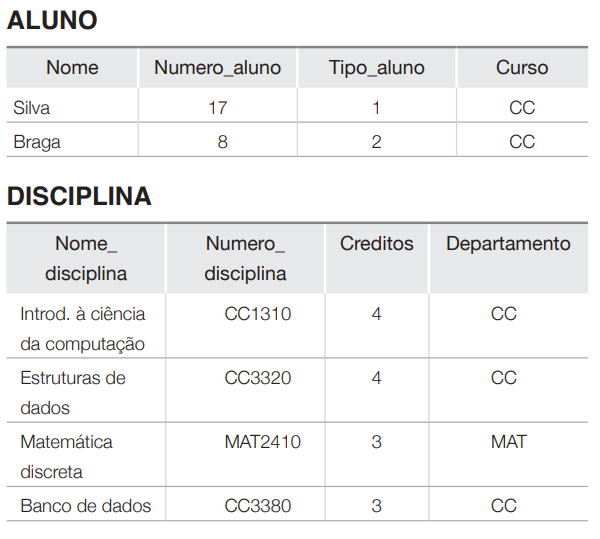

# 1.1 Introdução.

um **banco de dados** é uma coeção de dados relacionados. Os **dados** são fatos que podem ser gravados e que possuem um significado implícito.

- nomes
- números telefônicos
- CPF
- Endereços

Essa definição, é muito genérca. O uso do termo **BD** é geralmente mais restrito. Possui as seguintes propriedades implícitas.

- Representa algum aspecto do mundo real, chamado, às vezes, de **minimundo**
ou de **universo de discurso (UoD)**.
- Um **BD** é uma coleção lógica e coerente de dados co alguns significado inerente. Uma organização de dados ao acaso (aléatoria) não pode ser corretamente interpretada como um banco de dados.
- Um banco de dados é projetado, construido e povoado por dados, atendento a um proposito específico. 

Um bano de daos possui algumas fontes das quais os dados são derivados, alguns niveis de intereção com os eventos do mundo real e um público efetivamente interessado em seus conteúdos.

Um banco de dados pode ser gerado e mantido manualmente, ou pode ser computadorizado. Por exemplo, um catálogo de cartão de biblioteca é um
banco de dados que pode ser criado e mantido manualmente. Um banco de dados computadorizado pode ser criado e mantido por um grupo de programas de aplicação escritos especificamente para essa tarefa ou por um sistema gerenciador de banco de dados. Vamos tratar apenas dos bancos de dados computadorizados neste livro.

UM **Sistema gerenciador de banco de dados (SGBD)** é uma coleção de programas que permite aos usuários criar e manter um banco de dados. O SGBD é, portando, um sistema de sofware de propósito geral que facilita os processos de:

- Ddefinição;
- Construção;
- Manipulação;
- Compartilhamento, de banco de dados
- Proteção;
- Manutenção.

A **definição** de um banco de dados implica especificar os tipos de dados, as estruturas e as restrições para os dados a serem armazenados em um banco de dados.

A **construção** de um banco é o processod e armazenar os dados em alguma mídia apropriada controlada pelo SGBD.

A **Manipulação** inclui algumas funções, como pesquisas em banco de dados para recuperar um dado específico, atualização do banco para refletir as mudanças no minimundo e gerar relatórios dos dados.

O **compartilhameno** permite aos múltiplos usuários e programas acessar, de forma concorrente, o banco de dados.

A **proteção** contra o mau funcionamento ou falhas (crashes) no hardware ou software, e segurança contra acessos não autorizados ou maliciosos.
Um programa de aplicação acessa o banco de dados ao enviar consultas ou solicitações de dados ao SGBD. Uma **consulta (query)** normalmente resulta na recuperação de alguns dados; uma transação pode fazer que alguns dados sejam lidos e outros, gravados no banco de dados.

Um banco de dados tipico pode ter m ciclo de vida de muitos anos, então, os SGBD devem ser caazes de **manter** um sistema de banco de dados que permita a evolução  dos requisitos que se alteram ao longo do tempo.

Para completas a definição inicial, vamos chamar a união do banco de dados com o SGBD de **sistema de banco de dados**

# 1.2 um exemplo

um banco de dados **UNIVERSIDADE** para mante informações referentes a aluns, disciplinas e notas em um ambiente universitário. O banco de dados esta organizado em cinco **arquivos(coleção de registros)**, e ada um armazena **registro de dados** do mesmo tipo.

- O arquivo **ALUNO**  dados sore cada aluno;
- O arquivo **DISCIPLINA** armazena dados sore cada disciplina;
- O arquivo **TURMA** armazena dados sobre cada turma de uma disciplina;
- O arquivo **GISTORICO_ESCOLAR** armazena as notas que os alunos recebem nas várias turmas que eles concluiram;
- O arquivo **PRE_REQUISITO** armazena os pré-requisitos de cada disciplinas.

Para **definir** essse banco de dados, precisamos especificar a estrutura dos registros de cada arquivo, determinando os diferentes tipos de **elementos de dados** a serem armazenados em cada registro.

Temos no registro de ALUNO os dados **Nome, Numero_aluno, Tipo_aluno e Curso,**  que representam a abstração. Também precisamos especificar um tipo de dados para cada elemento de dado em um registro. Por exemplo, podemos especificar que o;

- Nome de ALUNO é uma sequência de caracteres alfabéticos
- Numero_aluno de ALUNO é um inteiro;
- Nota de HIStoRICO_ESCOLAR é um caractere do conjunto {'A', 'B', 'C', 'D', 'F'}.

Para construir o banco de dados UNIVERSIADE, armazenamos dados para representar cada aluno, disciplina, turma, histórico escolar e pré-requisito como um registro no arquivo apropriado. Observe que os registros nos diversos arquivos podem estar relacionados. 

Por exemplo, o registro para Silva no arqivo ALUNO está relacionado a dois registros no arquivo HISTORICO_ESCOLAR, que especifica as notas de Silva em duas turmas. De modo semelhante, cada regisro no arquivo PRE_REQUISITO relaciona-se a dois registros de disciplina. um representando a disciplina e o outro representando o pré-requisito. A maioria dos bancos de dados de tamanho médio e grande inclui muitos tipos de registros e possui muitos relacionamentos entre os registros. 

A manipulação do banco de dados envolve consulta e atualização.

 Alguns exemplos de consulta são os seguintes:
- Recuperar uma lista de todas as disciplinas e notas de 'Silva';
- Listas os nomes dos alunos que realizaram a disciplina 'Banco de dados' oferecida no segunto semestre de 2008 e suas notas nessa turma.
- Listar os pré-requisitos do curso de 'Banco de dados'.

Alguns exemplos de atualizações incluem:
- Alterar o tipo de aluno de 'Silva' para segundo ano.
- Criar outra turma para a disciplina 'Banco de dados' para este semestre.
- Inserir uma nota 'A' para 'Silva' na turma 'Banco de dados' do último semestre.

Nesse estágio, é útil descrever o banco de dados como parte de uma tarefa maior conhecida como sistema de informação dentro de qualquer organização Que consiste em vários computadores, sistemas de armazenamento, software de aplicação e bancos de dados. 

O projeto de uma nova aplicação para um banco de dados existente ou de um novo banco de dados começa com uma fase chamada **especificação e análise de requisitos**. Esses requisitos são documentados com detalhes e transformados em um **projeto conceitual**. 

O projeto é então traduzido para um **projeto lógico**  que pode ser expresso em um modelo de dados implementado em um SGBD comercial. O estáfio final é o **projeto físico** durante o qual outras especificações são fornecidas para armazenas e acessar o banco de dados. O projeto de banco de dados é implementado, alimentado com dados reais e mantido continuamente para refletir o estado do minimundo.