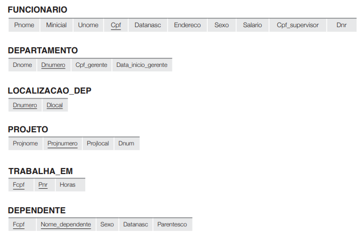
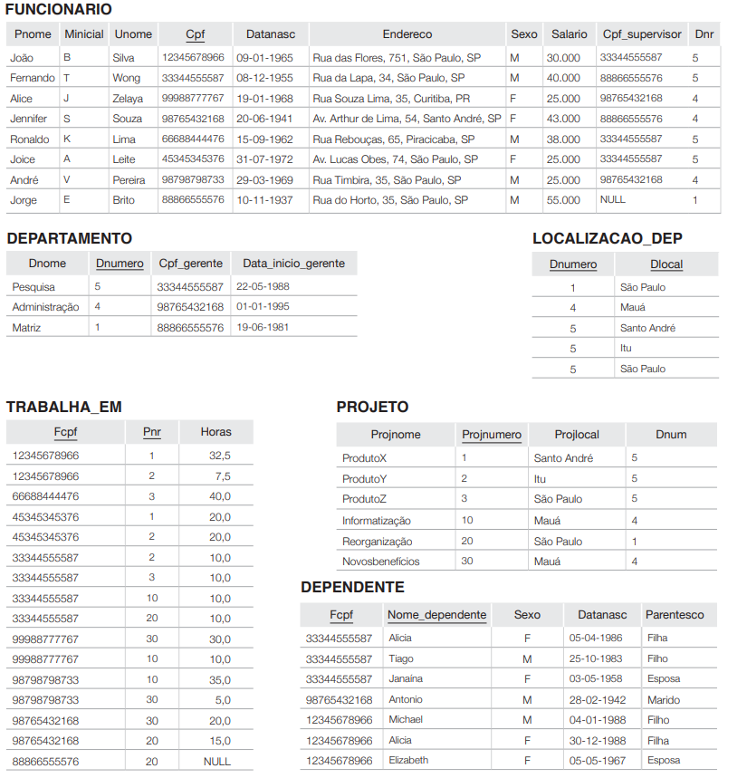
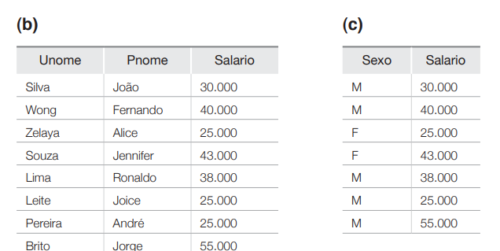
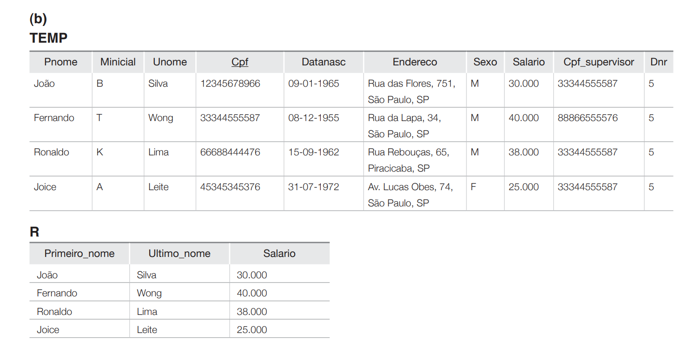
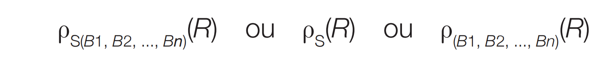

# Capitulo 6 - Algebra e cálculo relacional

Embora a álgebra defina um conjunto de operações para o modelo relacionla, o **cálculo relacional** oefere uma linguagem declarativa de nivel mais alto parra especificar consultas relacionais. UMa expressão do cálculo relacional gera uma nova relação. Em uma expressão do cálcuo relacional, não existe ordem de operações para especificar como recuperar o resultado da consulta - somente qual ifomação o resultado deve conter.

O cálculo relacional é importante porque tem uma firme base na lófica matmática e porque a linguagem de consulta padrão (SQL) para SGBDRs tem alguns de seus alicerces em uma variação do cálculo relacional conhecida como cálculo relacional de tupla.

teoria de conjuntos da matemática: **UNIÃO**, **INTERSECÇÃO**, **DIFERENÇA DE CONJUNTO** e **PRODUTO CARTESIANO** (também conhecida como PRODUTO CRUZADO).



## 6.1 Operações relacionais unárias: SELEÇÃO e PROJEÇÃO
Operações para banco de dados relacionais: **SELEÇÃO**, **PROJEÇÃO** e **JUNÇÃO**.

O símbolo da **seleção** em álgebra relacional é a letra grega sigma (σ).

A seleção **sigma (σ**) é usada para filtrar tuplas (linhas) de uma relação (tabela) com base em uma condição específica.

**π (pi)** é o símbolo usado para representar a operação PROJEÇÃO de relações.

**ρ (rho)** é usado para indicar o operador RENOMEAR


### 6.1.1 A operação SELEÇÃO    

A operação SELEÇÃO é usada para escolher um subconjunto das tuplas de uma relação que satisfaça uma condição de seleção. Pode-se considerar que a operação SELEÇÃO seja um filtro que mantém apenas as tuplas que satisfazem uma condição qualificadora. Como alternativa, podemos considerar que essa operação restringe as tuplas em uma relação para apenas aquelas que satisfazem a condição.

Por exemplo, para selecionar a tupla **FUNCIONARIO** cujo departamento é 4, ou aquelas cujo salário é maior do que R$ 30.000,00, podemos especificar individualmente cada uma dessas duas condições com uma operação SELEÇÃO da seguinte
maneira:

``` sql
σ Dnr > 4 (FUNCIONARIO);
σ Salario > R$ 30.000,00 (FUNCIONARIO);
``` 

Em geral, a operação SELEÇÃO é indicada por.
``` sql
σ <condição de seleção> (R - relação);
```

onde o símbolo **σ** (sigma) é usado para indicar o operador SELEÇÃO e a condição de seleção é uma expressão booleana (condição) especificada nos atributos da relação R. Observe que R costuma ser uma expressão da álgebra relacional cujo resultado é uma relação — a mais simples expressão desse tipo é apenas o nome de uma relação de banco de dados. A relação resultante da operação SELEÇÃO tem os mesmos atributos de R.

A expressão booleana especificada em **<condição seleção>** é composta de uma série de cláusulas
da forma
``` sql
<nome atributo> <op comparação> <valor constante>

ou 

<nome atributo> <op comparação> <nome atributo>
```

onde 
- O **nome atributo** é o nome do atributo da relação como salario(Funcionario)
- O **op comparação** em geral é um dos tipos de operadoes { =, <, >, <=, >=, !=} 
- O **valor constante** é um dado constante de valor do atributo, como o numero do departamento, ou o valor do salario.
- As cláusulas podem ser conectadas pelos operadores booleanos padrão, and(∧), or(∨) e not(¬)
    - σ idade > 18 ∧ cidade = 'Goiânia' (Aluno)
    - σ curso = 'SI' ∨ curso = 'Engenharia' (Aluno)
    - σ ¬(idade > 18) (Aluno)

Por exemplo, para selecionar as tuplas para todos os funcionários que ou trabalham no departamento 4 e ganham mais de R$ 25.000,00 por ano, ou trabalham no departamento 5 e ganham mais de R$ 30.000,00, podemos especificar a seguinte operação SELEÇÃO:

``` sql
 σ (Dnr = 4 ∧ salario > R$ 25.000,00) V (Dnr = 5 ∧  salario > R$ 30.000,00)(FUNCIONARIO)
 ```

 
Em SQL, a condição SELEÇÃO normalmente é
especificada na cláusula WHERE de uma consulta.
Por exemplo, a operação a seguir:

``` sql
σ Dnr=4 AND Salario>25.000 (FUNCIONARIO)

```
corresponderia à seguinte consulta SQL:

``` sql
SELECT *
FROM FUNCIONARIO
WHERE Dnr=4 AND Salario>25.000;
```

O operadore SELEÇÃO é **unário**: isso quer dizer que ele se aplica a uma unica relação por vez.
O resulando em um subconjunto das tuplas da tabela original, ou seja, algumas linhas que satisfazem a condição, com o mesmo número de atributos, o número de tuplas na relação resultante é sempre menor ou igual ao número de tuplas em R.

Sejam:<br>
∎ R(A1 , A2, ..., An) , o esquema de relação R ; ***Lista de tipos de atributos***<br>
∎ r(R) , uma relação r segundo o esquema R ; ***Conjunto de tublas (tabela de verdade).*** <br> 
∎ tj , uma tupla tal que tj ∊ r(R) ; ***A representação de 1 tubla (conjunto de dados)***<br>
∎ tj[Ai] (ou tj.Ai) , o valor na tupla tj para atributo Ai de R. ***Um valor da tupla***<br>

Então:

∀ tj ∊ r(R) ∧ ∀ Ai de R :<br>
tj[Ai] ∊ dom(Ai).

Para toda tupla **tj** na relação **r(R)**, e para todo atributo **Ai** definido no esquema **R**, o valor de **Ai** na tupla **tj** está no domínio permitido para esse atributo.


### 6.1.2 A operação PROJEÇÃO

Se pensarmos em uma relação como uma tabela, a operação **SELEÇÃO** escolhe algumas das linhas da tabela enquanto descarta outras linhas. A operação **PROJEÇÃO**, por sua vez, seleciona certas colunas da tabela e descarta as outras. Se estivermos interessados apenas em certos atributos de uma relação, usamos a operação PROJEÇÃO para projetar a relação apenas por esses atributos. Portanto, o resultado da operação PROJEÇÃO pode ser visualizado como uma partição vertical da relação em duas relações: uma tem as colunas (atributos) necessárias e contém o resultado da operação, e a outra contém as colunas descartadas. 

Por exemplo, para listar **último nome**, **primeiro nome** e **salário** de cada funcionário, podemos usar a operação PROJEÇÃO da seguinte forma:
``` sql
π Unome, pnome, salario(FUNCIONARIO)
```

Nós filtramos apenas os atributos que queremos ver. A formula geral da operação PROJEÇÃO é

``` sql
π <Lista de Atributos>(R - relação)
```
- p (pi) é o símbolo usado para representar a operação PROJEÇÃO
- E lista de Atributos  é a sublista desejada de atributos da relação R.
- R, em geral, é uma expressão da álgebra relacional cujo resultado é uma relação, que no caso mais simples é apenas o nome de uma relação do banco de dados.

O resultado da operação PROJEÇÃO tem apenas os atributos especificados em ***lista atributos*** na mesma ordem em que eles aparecem na lista. Logo, seu grau (quer dizer qual o numero de colunas que ira ter a lista) é igual ao número de atributos em ***lista atributos***.


- **(B)** - π Unome, pnome, salario(FUNCIONARIO)
- **(c)** - π sexo, salario (FUNCIONARIO)

# notas

Bem até o momento entendemos que **SELECT** fazer  uma filtagram nas tublas, para selecionar apenas a que queremos trabalhar, no caso de **PROJEÇÃO** faz uma filtragem nos atributos que queremos que seja exibido, na lista de tublas selecionadas por SELECT ou não. 

Em SQL, a lista de atributos de PROJEÇÃO é especificada na cláusula SELEÇÃO de uma consulta. Por exemplo, a operação a seguir:
``` sql
π <Lista de Atributos>(R - relação)
```

corresponderia à seguinte consulta SQL:
```
SELECT DISTINCT Sexo, Salario
FROM FUNCIONARIO
```

- DISTINCT serve para eliminar as duplicatas.


### 6.1.3 Sequências de operações e a operação RENOMEAR

As imagens motradas até agora no capitulo 6 representam resultados de operações da álgebra relacional, em geral para a maioria das cosultas precisamos aplicar varias operações da álgebra relacional uma após a outra.

Ou podemos escrevê-las como uma única expressão da ***álgebra relacional*** aninhando as operações, ou aplicar uma operação de cada vez e criar relações de resultado intermediário.

No último caso, temos de dar nomes às relações que mantêm os resultados intermediários. Por exemplo, para recuperar o primeiro nome, sobrenome e salário de todos os funcionários que trabalham no departamento número 5, devemos aplicar uma operação SELEÇÃO e uma PROJEÇÃO. Podemos escrever uma única expressão da álgebra relacional, também conhecida como uma
expressão em linha, da seguinte forma:

``` sql
π Pnome, Unome, Salario (σ Dnr = 5 (FUNCIONARIO))
```
A Figura 6.2(a) mostra o resultado dessa expressão da álgebra relacional em linha.

 <br>
Figura 6.2(a): Exemplo de operação de seleção na relação FUNCIONARIO.

Como alternativa, podemos explicitamente mostrar a sequência de operações, dando um nome a cada relação intermediária, da seguinte forma:

```
FUNCS_DEPT5 ← σ Dnr=5(FUNCIONARIO)
RESULTADO ← π Pnome, Unome, Salario(FUNCS_DEP5)
```
Também podemos usar essa técnica para renomear os atributos nas relações intermediárias e de resultado. Isso pode ser útil em conexão com operações mais complexas, como UNIÃO e JUNÇÃO

Para renomear os atributos em uma relação, simplesmente
listamos os novos nomes de atributo entre parênteses, como no exemplo a seguir:

``` 
TEMP ← σ Dnr=5(FUNCIONARIO) ***TEMP é um nome temporario da nova lista de tublas***

R(Primeiro_nome, Ultimo_nome, Salario) ← pPnome, Unome, Salario(TEMP)
```
- ***π Pnome, Unome, Salario (TEMP)***
   - É uma operação de projeção, ou seja, seleciona somente os atributos Pnome, Unome e Salario da relação temporária TEMP.
- ***R(Primeiro_nome, Ultimo_nome, Salario)***
    - Está renomeando os atributos na nova relação chamada R (R - poderia ser qual nome, pois representa a nova relação)
    - **Pnome** vira **Primeiro_nome**
    - **Unome** vira **Ultimo_nome**
    - **Salario** permanece igual



podemos definir uma operação RENOMEAR formal — que pode renomear o nome da relação ou os nomes de atributo, ou ambos — como um operador unário. A operação RENOMEAR geral, quando aplicada à relação R de grau n, é indicada por qualquer uma das três formas a seguir:



onde o símbolo ρ (rho) é usado para indicar o operador RENOMEAR, S é o nome da nova relação, e B1 , B2 , ..., Bn são os novos nomes de atributo. A primeira expressão renomeia tanto a relação quanto seus atributos, a segunda renomeia apenas a relação, e a terceira renomeia apenas os atributos. Se os atributos de R são (A1 , A2 , ..., An ) nessa ordem, então cada Ai é renomeado como Bi .

```
SELECT F.Pnome AS Primeiro_nome, F.Unome
AS Ultimo_nome, F.Salario AS Salario
FROM FUNCIONARIO AS F
WHERE F.Dnr=5,
```