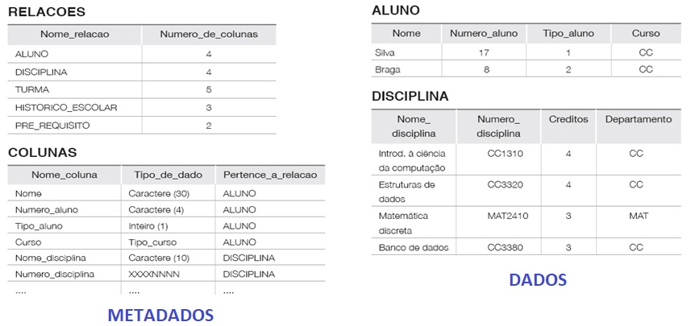

# Tópico 5 - Dados e Metados.

Definição abstrata de BD: uma coleção de dados relacionados.

Propriedades implícitas de BD

## DADO
E uma coleção logicamente coerente de dados com algum significado inerente; 
um arranjo aleatório de dados não pode ser considerado um banco de dados.

É projetado e construído com dados para um propósito específico; possui um grupo de usuários e algumas aplicações pré-concebidas, as quais esses usuários estão interessados. 

Representa algum aspecto do mundo real;  
alterações neste mundo real são refletidas no banco de dados.

Em síntese … Um banco de dados tem alguma fonte na qual os dados são derivados, alguma taxa de interação com eventos do mundo real, e uma audiência que está ativamente interessada em seu conteúdo.

## Dados vs. Metadados

Metadados descrevem, explicam, localizam ou tornam mais fácil recuperar, usar ou gerenciar um recurso de informação. Os metadados costumam ser chamados de dados acerca de dados (ou informações sobre informações).

- **Metadados descritivos** descrevem um recurso para fins de identificação e busca, tais como título, resumo, autor e palavras-chaves.
- **Metadados estruturais** indicam como os objetos compostos são colocados juntos, por exemplo, tal como as páginas são organizadas para formar capítulos.
- **Metadados administrativos** fornecem informações para ajudar a gerenciar um recurso, tais como data de criação do arquivo e tipo de arquivo.
Outro(s).

Os metadados são essenciais para garantir que os recursos possam sobreviver e permanecer acessíveis no futuro.

Para ilustrar a distinção entre dados e metadados, considere a figura a seguir. O banco de dados Universidade é composto por um conjunto de tabelas (no Modelo Relacional, fala-se um conjunto de relações).

O acesso e a interpretação dos dados são, essencialmente, baseados nos metadados, pois eles apoiam a solução de questões tais como:

Em que local estão os dados?
Quais os caminhos (as alternativas) de acesso aos dados?
Dentre os caminhos conhecidos para o acesso aos dados, qual é o mais ágil?
Como os dados estão estruturados?
Qual o conteúdo por trás desta sequência de caracteres (ou de bits)?
etc.
No contexto da área de Banco de Dados, a literatura usa vários termos para se referir aos metadados, alguns deles são: esquema de dados, descrição de dados, definição dos dados, dicionário de dados, catálogo de dados.

Exercício
Considere o conteúdo do texto Types of Metadata. Leia e releia o texto.
Observe que a tabela na segunda página do texto possui 06 linhas, cada linha se refere a um tipo de metadados, conforme a seguir (identificados de 1 a 6):

- Descriptive metadata
- Technical metadata
- Preservation metadata
- Rights metadata
- Structural metadata
- Markup languages

# Tipos de Metadados e Linguagens de Marcação

## Tipos de Metadados  

- **Descriptive Metadata (Metadados Descritivos)**  
  - Fornecem informações para identificar e recuperar um recurso. 
  - Incluem título, autor, palavras-chave, resumo, etc.
  - **Exemplo:** Título e autor de um livro em uma biblioteca digital.  

- **Technical Metadata (Metadados Técnicos)**  
  - Contêm detalhes técnicos sobre o formato e a criação de um recurso. 
  - Incluem tipo de arquivo, resolução, codec de vídeo, taxa de compressão, etc.
  - **Exemplo:** Metadados EXIF de uma foto (abertura, velocidade do obturador, modelo da câmera).  

- **Preservation Metadata (Metadados de Preservação)**  
  - Garantem a preservação e autenticidade de um recurso a longo prazo. 
    - Incluem informações sobre migração de formatos, histórico de modificações e auditoria. 
  - **Exemplo:** Registro de alterações em um manuscrito digitalizado.  

- **Rights Metadata (Metadados de Direitos)**  
  - Definem restrições e permissões de uso de um recurso.
  - Incluem informações de copyright, licenciamento, termos de uso.
  - **Exemplo:** Licenciamento de um vídeo no YouTube (Creative Commons, Copyright).  

- **Structural Metadata (Metadados Estruturais)**  
  - Indicam como as partes de um recurso estão organizadas e relacionadas.  
  - Incluem capítulos de um livro digital, links entre páginas de um site.
  - **Exemplo:** Marcações em um e-book indicando o início de cada capítulo.  

 - **Linguagens de Marcação (Markup Languages)** 
    - **HTML (HyperText Markup Language)** → Estrutura páginas web.  
    - **XML (eXtensible Markup Language)** → Organiza e armazena dados hierárquicos.  
    - **Markdown** → Linguagem simples para formatação de textos (usado no GitHub, documentação).  

---

## **Resumo**  
✅ **Metadados** ajudam a organizar, preservar e entender dados.  
✅ **Linguagens de marcação** estruturam e formatam informações digitais.  
