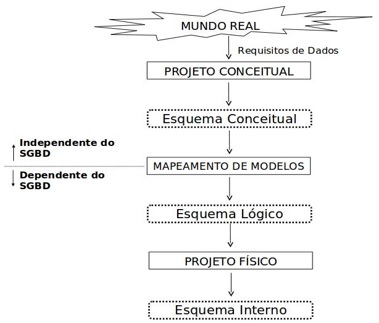
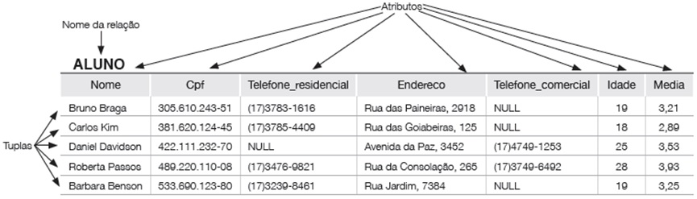

## [Tópico T08] - Modelo Relacional (MR) - Primeiros passos e _Checklist_
###### *by Prof. Plinio Sa Leitao-Junior (INF/UFG)*

O projeto de banco de dados (projeto conceitual, projeto lógico, etc.) emprega modelos de dados para produzir esquemas do banco de dados (esquema conceitual, esquema lógico, etc.). Modelos de dados promovem a percepção abstrata _da estrutura, da composição de conteúdo e das restrições de integridade_ em algum nível de abstração. Nesse sentido, cada modelo de dados se refere a um nível próprio de abstração, para guiar a criação e a evolução de um esquema de banco de dados. 

A figura a seguir apresenta níveis de abstração para os vários esquemas de um mesmo banco de dados.

O **Modelo Relacional (MR)** é comumente aplicado na etapa **projeto lógico** do banco de dados. O projeto lógico lida com a **especificação lógica** do banco de dados (**esquema lógico**), que é uma representação em uma abstração de alto-nível, embora o esquema conceitual seja em nível mais alto do que o esquema lógico.

O modelo relacional representa o banco de dados como uma **coleção de relações**:
- uma relação se assemelha a uma tabela de valores (mas entre os conceitos _relação_ e _tabela_ há dessemelhanças);
- cada linha da tabela possui **valores de dados relacionados**:
  - **uma linha representa um fato**, que normalmente corresponde a uma entidade ou relacionamento do mundo real.

A figura a seguir ilustra a noção de relação, conforme em [1]:

Para o Modelo Relacional (MR), um *checklist* com a maioria dos conceitos deste modelo é apresentado abaixo.

| Conceito | Explicação |
|----------|-----------|
| **Modelo Relacional** | Modelo de banco de dados baseado em tabelas (relações) para armazenar e manipular dados. |
| **Relação** | Conjunto de tuplas (linhas) que compartilham os mesmos atributos (colunas), representado por uma tabela. |
| **Esquema de Relação** | Estrutura da relação, incluindo nome e atributos com seus tipos de dados. |
| **Esquema de Banco de Dados Relacional** | Conjunto de esquemas de relação que definem a estrutura do banco de dados. |
| **Banco de Dados _vs._ Instância de Banco de Dados** | O banco de dados é a estrutura (esquema), enquanto a instância é o estado atual dos dados armazenados. |
| **Nome de Relação** | Nome único atribuído a uma tabela no banco de dados. |
| **Atributo** | Coluna de uma relação, representando uma característica dos dados armazenados. |
| **Tupla** | Linha de uma relação, representando um registro individual. |
| **Domínio de Atributo** | Conjunto de valores permitidos para um atributo (ex.: idade pode ter valores inteiros positivos). |
| **Cardinalidade de Domínio de Atributo** | Número total de valores possíveis dentro do domínio de um atributo. |
| **Produto Cartesiano dos Domínios de Atributos _vs._ Domínio de Relação** | O produto cartesiano combina todos os valores possíveis dos atributos, enquanto o domínio de relação contém apenas as tuplas válidas segundo as restrições do esquema. |
| **Grau de uma Relação** | Número de atributos (colunas) da relação. |
| **n-Tupla** | Tupla com `n` atributos, ou seja, um registro contendo `n` colunas. |
| **Valor NULL** | Representa a ausência de um valor em um atributo, podendo indicar desconhecimento ou inexistência. |
| **Ordenação de Tuplas no Modelo Relacional** | No modelo relacional, as tuplas não possuem uma ordem específica, pois as tabelas são tratadas como conjuntos matemáticos. |
| **Restrição de Integridade** | Regras que garantem a validade e consistência dos dados no banco. |
| **Restrição de Integridade de Entidade** | Nenhuma tupla pode ter um valor `NULL` em um atributo que faça parte da chave primária. |
| **Restrição de Integridade Referencial** | Garante que valores de uma chave estrangeira correspondam a valores existentes na tabela referenciada. |
| **Chave Primária** | Atributo ou conjunto de atributos que identificam de forma única cada tupla em uma relação. |
| **Chave Estrangeira** | Atributo que referencia uma chave primária de outra tabela, estabelecendo uma relação entre tabelas. |
| **Chave e Superchave** | Superchave é qualquer conjunto de atributos que identifica unicamente uma tupla. A chave primária é a superchave mínima. |
| **Chave Candidata** | Qualquer conjunto mínimo de atributos que pode ser escolhido como chave primária. |
| **Operações de Manipulação de Dados: Inserir, Excluir e Alterar** | Operações `INSERT`, `DELETE` e `UPDATE`, usadas para modificar os dados de uma relação. |
| **Restrição de Chave** | Garante que os valores da chave primária sejam únicos dentro da relação. |
| **Etc.** | Outros conceitos podem ser adicionados conforme necessário. |

>Para que que haja melhor fluência no emprego do MR, é pertinente e importante que entendamos **todos** os conceitos presentes no ***checklist* de conceitos** do MR, apresentado acima.

Esses conceitos serão empregados nos próximos tópicos. Contudo, desde já é mandatório que sejam lidos e estudados no capítulo pertinente ao conteúdo no livro sugerido[1]. 

### Exercício

Dentre os conceitos presentes no **_Checklist_ sobre o Modelo Relacional** acima, alguns deles são apresentados abaixo:

**(a)**  Nenhum valor de chave primária pode ser NULL 
**(b)**  Garante a consistência entre tuplas que se relacionam 
**(c)**  Conjunto de esquemas de relação: { R1, R2, ..., Rm } 
**(d)**  Conjunto de relações: { r1(R1), r2(R2), ..., rm(Rm) } 
**(e)**  R(A1, A2, ...,An) 
**(f)**  Conjunto de n-tuplas: { t1, t2, ..., tm } 
**(g)**  Lista ordenada de _m_ valores: <v1, v2, ..., vm> 
**(h)**  Subconjunto do produto Cartesiano dos domínios: r(R) ⊆ ( dom(A1) × dom(A2) × ... × dom(An) ) 
**(i)**  Número total de distintos valores que um atributo pode ter 
 
1. Observe os itens acima de (a) até (i). 
Para cada dos itens acima, identifique o conceito correspondente no *checklist*. 
Responda segundo o modelo: 
&#8718; **(letra) texto do item no _checklist_**: 
∎ (a) Chave primária  
∎ (b) Restrição de integridade referencial  
∎ (c) Esquema de banco de dados relacional  
∎ (d) Banco de dados _vs._ Instância de banco de dados  
∎ (e) Esquema de relação  
∎ (f) Relação  
∎ (g) n-Tupla  
∎ (h) Domínio de relação  
∎ (i) Cardinalidade de domínio de atributo  

