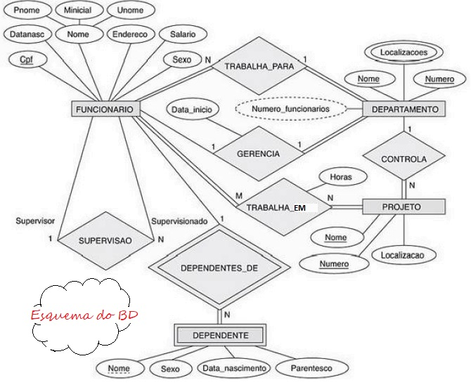
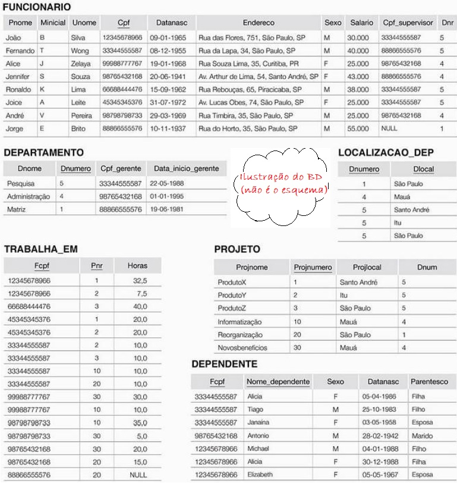

## [Tópico T09] - Modelo Relacional (MR) - Restrições de Integridade
###### *by Prof. Plinio Sa Leitao-Junior (INF/UFG)*

Sejam as duas figuras abaixo, ambas se referem ao **BD Empresa** [1]:
- [Um **esquema conceitual**](../media/fig-der-empresa.jpg), segundo o Modelo Entidade Relacionamento (MER).

- [Uma *ilustração para o banco de dados*](../media/fig-mr-2.jpg), para um **esquema lógico** segundo o Modelo Relacional (MR):

  - dados são mostrados nesta figura para apoiar o entendimento dos metadados.

| **Como o *esquema conceitual* (esq.) resultou no *esquema lógico* usado na ilustração do BD (dir.)?** |
|-|

```diff
- Há diretrizes para transição do esquema conceitual para o esquema lógico ?
+ Sim, é preciso estar atento ao significado de cada elemento no esquema conceitual ..
! Mas o mapemento entre esquema conceitual e esquema lógico será tratado em tópico futuro-próximo ..
```

> Em um banco de dados relacional, usualmente há muitas relações (várias, ou até muitas, tabelas).<br>
> As _tuplas_ presentes nas relações em geral estão relacionadas entre si de várias maneiras.<br>
> Comumente, há restrições para os valores presentes nas _tuplas_ ..., conforme introduzido a seguir.

### Restrição de domínio

Sejam:<br>
&#8718; **R(A<sub>1</sub> , A<sub>2</sub>, ..., A<sub>n</sub>)** , o esquema de relação **R** ;<br>
&#8718; **r(R)** , uma relação **r** segundo o esquema **R** ;<br>
&#8718; **t<sub>j</sub>** , uma _tupla_ tal que **t<sub>j</sub> &#8714; r(R)** ; e<br>
&#8718; **t<sub>j</sub>[A<sub>i</sub>]** (ou **t<sub>j</sub>.A<sub>i</sub>**) , o valor na tupla **t<sub>j</sub>** para atributo **A<sub>i</sub>** de **R** .

Então:
- **&#8704; t<sub>j</sub> &#8714; r(R)**  &#8743;  **&#8704; A<sub>i</sub>** de **R** :
  - **t<sub>j</sub>[A<sub>i</sub>] &#8714; dom(A<sub>i</sub>)**.

Ou seja, a **restrição de domínio** determina que, em cada _tupla_, o valor do atributo **A<sub>i</sub>** deve ser:<br>
&#8718; um valor atômico; e<br>
&#8718; um valor pertencente ao domínio de **A<sub>i</sub>** (ou seja, **dom(A<sub>i</sub>)**).

Domínios de atributos são implementados pelo uso de:<br>
&#8718; tipos de dados (exemplos: números inteiros, números reais, data e hora, etc.), faixa de valores, lista de valores, valores enumerados, etc., além de valores impostos por outras restrições, tal como restrição de integridade referencial.

### Restrição de chave

Por definição, **uma relação é um conjunto de _tuplas_**:
- Formalmente, um conjunto não possui elementos repetidos:
  - cada _tupla_ é um elemento da relação (conjunto de _tuplas_);
  - então, não há _tuplas_ repetidas em uma relação.
- Noutras palavras, duas ou mais _tuplas_, de qualquer relação **r(R)**, não podem ter a mesma combinação de valores para todos os atributos de R:
  - ou seja, há a **restrição de exclusividade** para os valores das _tuplas_ de qualquer relação.

Há subconjuntos de atributos de **R** - pelo menos um subconjunto - tal que duas ou mais _tuplas_, de qualquer relação **r(R)**, não podem ter a mesma combinação de valores para os atributos de cada subconjunto:
- Cada subconjunto **SK<sub>i</sub>** é uma **superchave** de **R**:
  - ou seja, há a **restrição de exclusividade** para os valores das _superchaves_ de qualquer relação.

>Contudo, **superchaves** podem ter atributos supérfluos com respeito à **restrição de exclusividade**.

Uma **superchave SK<sub>i</sub> em R** é uma **chave em R** se não tiver atributos supérfluos com respeito à **restrição de exclusividade**:
  - por exemplo, suponha que no esquema de MUNICIPIO há superchaves {Cidade, Estado, Área} e {Cidade, Estado}:
    - contudo, somente {Cidade, Estado} é uma chave em MUNICIPIO.

Segundo [1], para entender **_chave vs. superchave_**:<br>
&#9745; Duas _tuplas_ distintas, em qualquer [estado de] relação, não podem ter valores idênticos para [todos] os seus atributos.<br>
&#9745; A propriedade de exclusividade se aplica a chaves e a superchaves.<br>
&#9745; Uma chave é uma superchave mínima - ou seja, uma superchave da qual não podemos remover nenhum atributo e ainda manter a restrição de exclusividade.<br>
&#9745; A propriedade de minimalidade é necessária para uma chave, mas é opcional para uma superchave.

Portanto, **_uma chave é uma superchave_**, mas não vice-versa [1]:
- Uma _**superchave pode ser uma chave**_ (se for mínima) ou pode não ser uma chave (se não for mínima).
- Considere a relação ALUNO, em que o conjunto de atributos {Matricula} é uma chave, pois duas _tuplas_ de alunos não podem ter o mesmo valor para os atributos dessa chave.
- Qualquer conjunto de atributos que inclua _Matricula_, por exemplo, _{Matricula, Nome, DataDeNascimento}_ é uma superchave:
  - no entanto, a superchave _{Matricula, Nome, DataDeNascimento}_ não é uma chave de ALUNO, porque remover _Nome_ ou _DataDeNascimento_ ou ambos do conjunto ainda caracteriza uma superchave. 
- Em geral, qualquer superchave formada a partir de um único atributo também é uma chave.

Não é raro que um esquema **R** tenha mais de uma **chave em R**:
- Cada uma das **chaves em R** é usualmente chamada de **chave candidata**.
- Dentre as chaves candidatas, uma delas é designada **chave primária** da relação:
  - do inglês, _Primary Key_ (**PK**).

| Conforme o modelo relacional, os seguintes aspectos estão ligados à restrição de chave: |
| --------------------------------------------------------------------------------------- |
| Cada esquema de relação R possui uma chave candidada escolhida como chave primária.     |
| A chave primária possui a restrição de exclusividade para as _tuplas_ de qualquer r(R).   |

### Restrição de integridade de entidade

A chave primária identifica as _tuplas_ individuais de toda relação.<br>
A **restrição de integridade de entidade** determina que qualquer atributo da chave primária não pode assumir valor nulo. 

### Restrição de integridade referencial

A **restrição de integridade referencial** ocorre entre duas _tuplas_, as quais pertencem a relações não necessariamente distintas.<br>
Na prática, a restrição é aplicada quando um _tupla_ faz referência a outra _tupla_.

> A integridade referencial busca garantir que **a referência entre _tuplas_ é consistente**.

A restrição de integridade referencial é implementada por meio do conceito de **chave estrangeira**:
- Do inglês, _Foreign Key_ (**FK**).
- Por exemplo, sejam os esquemas PRODUTO(_CodProduto_, Descrição, Preço) e CATEGORIA(_CodCateg_, Nome), cujas chaves primárias são _CodProduto_ e _CodCateg_, respectivamente:
  - para implementar a associação **produto possui categoria**, é incluída uma chave estrangeira em PRODUTO:
    - em PRODUTO(CodProduto, Descrição, Preço, **Categ**), foi inserido o atributo **Categ**;
    - o atributo **Categ** em PRODUTO é uma chave estrangeira, pois referencia o atributo **CodCateg**, que é a chave primária de CATEGORIA.
  - para ilustar, sejam as _tuplas_:
    - o produto *<1234, "caneta", R$2,00, "Papel">* e a categoria *<"Papel", "Papelaria e escritório">*;
    - o valor da chave estrangeira em PRODUTO é "Papel" e o valor da chave primária em CATEGORIA é "Papel".

Os atributos da FK no esquema R é uma chave estrangeira que faz referência à relação S, se:
1. Os atributos da FK (chave estrangeira) em R têm o mesmo domínio que os atributos da PK (chave primária) de S; e
2. Qualquer valor de FK em uma _tupla_ **t<sub>1</sub>** da relação r(R):
   - é um valor de PK para alguma _tupla_ **t<sub>2</sub>** na relação s(S); ou
   - é NULL. 

Em suma, a restrição de integridade referencial busca garantir que t1[FK] = t2[PK], para qualquer FK no esquema de banco de dados.

## Exercício

Considere o banco de dados de um **_software_ de vendas online**, com as seguintes definições em nível lógico:<br>
&#8718; os esquemas PRODUTO(_CodProduto_, Descrição, Preço, Categ) e CATEGORIA(_CodCateg_, Nome);<br>
&#8718; as chaves primárias _CodProduto_ e _CodCateg_ para PRODUTO e CATEGORIA, respectivamente;<br>
&#8718; o atributo **Categ** em PRODUTO que referencia CATEGORIA.

Pergunta: **Quais as chaves estrangeiras no esquema lógico do BD Vendas Online?**<br>
Resposta: **PRODUTO(Categ) REFERENCIA CATEGORIA(CodCateg)**<br>
Obs.: observe a notação para responder a pergunta:<br>
&#8718; _RELAÇÃO(FK) REFERENCIA RELAÇÃO(PK)_

### **RESPOSTA**

 PRODUTO(Categ) REFERENCIA CATEGORIA(CodCateg)


| **Sigla** | **Item** | **Definição** |
|-----------|----------|---------------|
| **PK**    | Chave Primária | É um atributo ou conjunto de atributos que identifica de forma única cada tupla (registro) de uma tabela. Cada tabela tem **apenas uma** chave primária. |
| **FK**    | Chave Estrangeira | Atributo em uma tabela que faz referência à chave primária de outra tabela, estabelecendo uma relação entre elas. |
| **SKi**   | Super Chave | Conjunto de atributos que pode identificar unicamente uma tupla em uma tabela. Pode ser composta por mais de um atributo. Várias super chaves podem existir, mas a **chave candidata** é a menor delas. |
| **R(A1, A2, ..., An)** | Esquema de Relação | Definição de uma relação, representada por uma tabela, onde **A1, A2, ..., An** são os atributos da tabela. Representa a estrutura lógica da tabela, sem dados. |
| **r(R)**  | Relação r segundo o esquema R | Uma instância ou conjunto de dados que satisfaz o esquema de relação **R**. Ou seja, **r(R)** é a tabela com os valores das tuplas para o esquema **R**. |
| **tj**    | Tupla | É uma linha ou registro na tabela. Representa uma instância dos dados, composta pelos valores dos atributos definidos no esquema. |
| **tj[Ai] (ou tj.Ai)** | Valor de um Atributo na Tupla | Representa o valor do atributo **Ai** na tupla **tj**. **tj[Ai]** ou **tj.Ai** é o valor específico do atributo **Ai** para a tupla **tj**. |
| **tj[Ai] ∊ dom(Ai)** | Valor de Atributo em um Domínio | O valor de **tj[Ai]** pertence ao domínio de **Ai**. Ou seja, o valor de **tj[Ai]** deve ser um valor válido dentro do conjunto de valores possíveis para o atributo **Ai**. |
