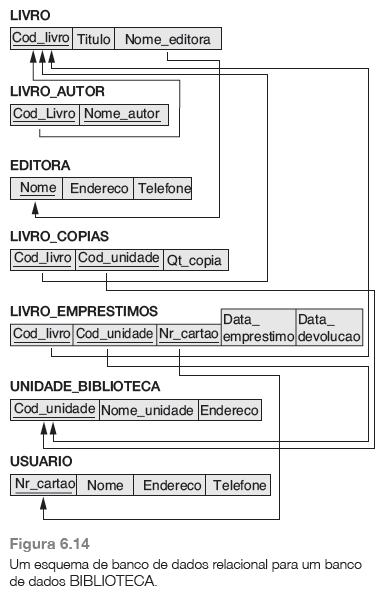

## Questão 1
Reflita sobre um "caminho" para o processamento de cada das consultas abaixo:
(a) Quantas cópias do livro intitulado “Tribo Perdida” existem na unidade da biblioteca cujo nome é “Central” ?

(b) Quantas cópias do livro intitulado “Tribo Perdida” existem em cada unidade da biblioteca ?

(c) Recupere o nome de todos os usuários que não possuem livros registrados em seu nome.

(d) Para cada livro que é emprestado da unidade Central e cuja data de devolução é hoje, recupere o título do livro, o nome e o endereço do usuário.

(e) Para cada unidade da biblioteca, recupere o nome da unidade e o número total de livros retirados de lá.

(f) recupere o nome, endereço e número de livros emprestados para todos os usuários que possuem mais de cinco livros emprestados.

(g) Para livro cujo autor (ou coautor) é Stephen King, recupere o título e o número de cópias pertencentes à unidade da biblioteca cujo nome é “Central”.