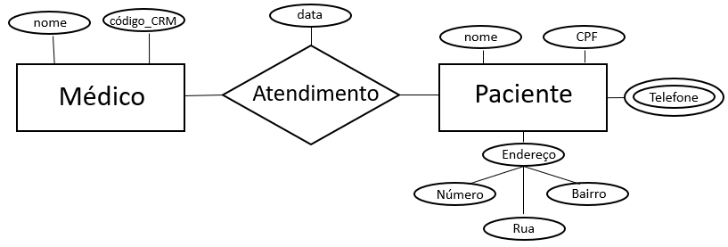

# Tópico  4a - Requisitos de Dados - Bd empresas

Há problemas no mundo real cuja solução pode ser alcançada por meio de **software**. 
As necessidades e restrições colocadas em um produto de software são representadas por **requisitos de software**. 

A análise, elicitação e especificação de requisitos é uma das etapas do **processo de software**. 
Requisitos de software são expressos (especificados) em **artefatos**, cuja construção em geral aplica **modelos** e emprega **notações** tal como a UML, com o apoio de **ferramentas** na escrita desses artefatos.

Ao projetar bancos de dados, os artefatos resultantes &#8212; esquemas de banco de dados &#8212; devem ser tais que contribuam para a missão do software:
- **Questão 01a:** O que significa **projetar um banco de dados**?
- **Questão 01b:** O que é produzido ao **projetar um banco de dados**? Que artefatos são gerados?

Se o banco de dados é parte integrante de um produto de software, então:
- **Questão 02a:** Que esquema de banco de dados atende aos **requisitos de software**?
- **Questão 02b:** Vários esquemas de banco de dados distintos podem atender aos **requisitos de software**?

Independente da classificação de requisitos de software &#8212; funcional ou não-funcional; prioridade do requisito; etc. &#8212; há os **requisitos de dados**, que é parte integrante de todo o conjunto de requisitos de software:
- Os requisitos de dados são os requisitos considerados para o processo de projeto (_design_) de banco de dados.
- Veja a Figura 7.1 no Capítulo 7 da 6a. edição do livro [1], para uma ilustração de contexto dos requisitos de dados.

O processo de projeto de banco de dados inicia por **abstrair os requisitos de dados**:
- **Questão 03a:** Como saber se um esquema de banco de dados, que é produzido pelo processo de projeto de banco de dados, é *adequado* à missão do software?
- **Questão 03b:** O esquema de banco de dados produzido retrata as necessidades, a estrutura e as restrições próprias para o banco de dados?

> Há esquemas de banco de dados em vários níveis de abstração: conceitual, lógico, físico, ...

### Exemplo de requisitos de dados Banco de Dados Empresa - BD Empresa

O livro sugerido [1] para a disciplina inclui requisitos de dados para o **Banco de Dados Empresa** (*Company Database*). Este banco de dados é explorado em quase todo o livro. Os requisitos são apresentados abaixo, na forma de ***descrição textual***, conforme posto no livro.

>***A empresa é organizada em departamentos. Cada departamento tem um nome exclusivo, um número exclusivo e um funcionário em particular que o gerencia. Registramos a data inicial em que esse funcionário começou a gerenciar o departamento. Um departamento pode ter vários locais. 
Um departamento controla uma série de projetos, cada um deles com um nome exclusivo, um número exclusivo e um local exclusivo. 
Armazenamos o nome, número de Cadastro de Pessoa Física, endereço, salário, sexo (gênero) e data de nascimento de cada funcionário. Um funcionário é designado para um departamento, mas pode trabalhar em vários projetos, que não necessariamente são controlados pelo mesmo departamento. Registramos o número atual de horas por semana que um funcionário trabalha em cada projeto. Também registramos o supervisor direto de cada funcionário (que é outro funcionário). 
Queremos registrar os dependentes de cada funcionário para fins de seguro. Para cada dependente, mantemos o nome, sexo, data de nascimento e o parentesco com o funcionário.***

Em nossa disciplina, o **BD Empresa** será utilizado para ilustrar conceitos e apresentar exemplos pertinentes a banco de dados. Outrossim, outros bancos de dados, contextos e aplicações serão explorados, para enriquecer as discussões e ampliar os esforços de compreensão e a escala de aprendizagem.

>*Usaremos o **BD Empresa** em vários dos exemplos apresentados, além de outros bancos de dados, contextos e aplicações.*

Então, vamos nos apropriar (memorizar?) dos requisitos de dados do BD Empresa.

## Exercícios

Leia e releia os requisitos de dados pertinentes ao **BD Empresa**.

1. Identifique 05 (cinco) pontos de imprecisão nos requisitos de dados, conforme o exemplo abaixo: 
**Ponto 1:** Não está claro se um dependente é obrigatoriamente um parente do seu empregado responsável. 
**Ponto 2:** Múltiplos Gerentes: Não há clareza se um departamento pode ter mais de um gerente ao longo do tempo e como isso seria armazenado.  
**Ponto 3:** Locais de Projetos e Departamentos: Não está especificado se um projeto pode estar associado a mais de um local, assim como ocorre com departamentos.br>
**Ponto 4:** Salário e Histórico: Não há menção sobre a necessidade de armazenar o histórico de salários dos funcionários. Se um salário for alterado, a informação anterior será perdida? 
**Ponto 5:** Horas de Trabalho em Projetos: Não está definido se há um limite mínimo ou máximo de horas que um funcionário pode dedicar a projetos por semana.

1. Elabore 05 consultas (demandas informacionais) que podem ser respondidas a partir dos requisitos de dados, conforme o exemplo abaixo: 
**Consulta 1:** Qual o nome dos funcionários que são supervisores e gerentes de departamento? 
**Consulta 2:** Quantos projetos cada funcionário trabalha e quantas horas ele dedica a cada um?  
**Consulta 3:** Quais funcionários possuem dependentes e qual a relação de parentesco com cada um?  
**Consulta 4:** Qual o salário médio dos funcionários por departamento?  
**Consulta 5:** Quais funcionários trabalham em projetos que não pertencem ao seu departamento de origem?  

Importante: Evite consultas (demandas informacionais) simples, tal como "Quais os nomes dos funcionários de sexo masculino?".

# Entidades e Atributos, relacionameto

**Entidade**
Uma entidade representa um objeto do mundo real que pode ser identificado de forma única dentro de um sistema de banco de dados. Pode ser um objeto físico (como uma pessoa, um carro, um produto) ou um conceito abstrato (como um pedido, uma venda, uma conta bancária).

📌 Exemplo:

"**Funcionário**" pode ser uma entidade que representa os empregados de uma empresa.

"**Projeto**" pode ser uma entidade que representa diferentes projetos desenvolvidos.

Atributos:
São as características ou propriedades que descrevem uma entidade. Cada entidade possui um conjunto de atributos que armazenam informações sobre ela.

📌 Exemplo de Atributos da entidade "Funcionário":

Nome

CPF (Identificador único)

Endereço

Salário

Data de Nascimento

Sexo

### **Conceito e Forma dos Relacionamentos**  

Os **relacionamentos** representam a associação entre duas ou mais entidades em um banco de dados. Eles indicam como os dados de uma entidade estão conectados aos dados de outra entidade.  

#### **1. Representação dos Relacionamentos**  
No **Modelo Entidade-Relacionamento (MER)**, os relacionamentos são representados por **losangos** (diamantes) e conectam entidades (que são representadas por retângulos).