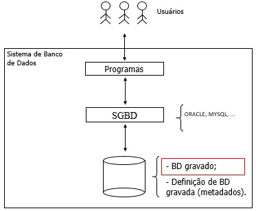
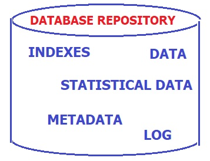
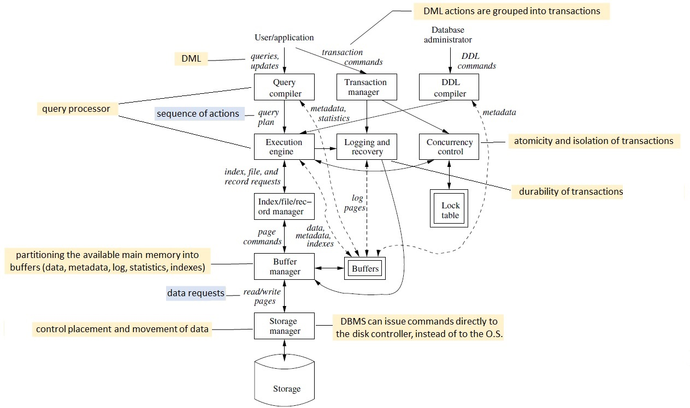

## Tópico 6 - Sistema gerenciador de banco de dados.

Um Sistema de Gerenciador de Banco de Dados (SGBD) é um **software** que apoia os usuários na criação e manutenção de um banco de dados. O termo ***usuários*** é empregado aqui com sentido amplo e inclui: *administrador de banco de dados*, *projetista de banco de dados*, *usuário final*, *programador de aplicação*, etc.

O SGBD atua nos processos de definição, construção, manipulação e compartilhamento de bancos de dados entre usuários e aplicações:
- **Definição de banco de dados:** se refere à especificação de tipos de dados, estruturas de dados, regras e restrições de integridade, etc., que são armazenadas no dicionário (catálogo) de dados.
- **Construção de banco de dados:** denota a armazenagem de dados em meio controlado pelo SGBD; noutras palavras é a carga inicial do banco de dados.
- **Manipulação de banco de dados:** lida com a consulta ao banco de dados para *recuperar* dados específicos, e a atualização do banco de dados para *estar em sintonia* com os dados do mundo real.
- **Compartilhamento de banco de dados**. visa ao acesso simultâneo de vários usuários e programas ao banco de dados.

O SGBD deve trabalhar uniformemente com vários tipos de aplicação de banco de dados – por exemplo, universidade, instituição bancária, etc. – sempre utilizando a *definição de dados* gravada no catálogo.

> **O SGBD é de propósito geral. Os metadados são de propósito específico.**
> 
A Figura à esquerda abaixo mostra um **sistema de banco de dados** genérico, em que usuários interagem com programas de aplicação por meio de suas *interfaces*. O acesso propriamente dito aos dados ocorre por meio do SGBD que, por sua vez, necessita dos metadados para atender às solicitações oriundas dos usuários. 

A figura à direita abaixo apresenta um escopo mais amplo sobre o banco de dados, que inclui vários conteúdos adicionais aos dados: dicionário de dados, índice, dados estatísticos. Nesse sentido, o SGBD emprega os conteúdos adicionais para aprimorar o desempenho de suas funções. Por exemplo, o SGBD avalia se há a presença de um índice que possa ser aplicado a uma operação específica, tal que torne o atendimento a tal operação mais eficiente (em tempo).

Algumas benefícios potenciais para o emprego de SGBDs são:
- suporte a múltiplas visões dos dados;
- compartilhamento de dados entre múltiplos usuários;
- consistência transacional;
- restrição de acesso aos dados para usuários não autorizados;
- suporte à redundância controlada;
- garantia da restrição de integridade, que mantém os dados íntegros (consistentes);
- mecanismos de segurança dos dados, tais como, cópia (*backup*) e recuperação (*recovery*) de dados;
- etc.

A Figura a seguir explora os _componentes_ da **Arquitetura de um SGBD** típico, conforme [1].

## Exercício

Considere os seguintes componentes da **Arquitetura de um SGBD** típico (identificados de 1 a 6):

1. Concurrency control
2. Transaction manager
3. Query compiler
4. Logging and recovery
5. Buffer manager
6. Execution engine

Pesquise sobre cada um dos componentes da arquitetura típica de um SGBD listados acima.

### 1️⃣ Concurrency Control (Controle de Concorrência)
- Responsável por gerenciar o acesso simultâneo de múltiplas transações ao banco de dados.
- Evita condições de corrida, anomalias de leitura, deadlocks e garante isolamento das transações.
- Utiliza técnicas como:
  - Bloqueios (Locks): Controle de acesso exclusivo a determinados dados.
  - Timestamp Ordering: Ordenação baseada em carimbos de tempo das transações.
  - Multiversion Concurrency Control (MVCC): Mantém múltiplas versões dos dados para leitura sem bloqueios.

### 2️⃣ Transaction Manager (Gerenciador de Transações)
- Controla transações dentro do banco de dados, garantindo as propriedades ACID:
  - Atomicidade: A transação ocorre completamente ou não ocorre.
  - Consistência: O banco de dados permanece válido após a transação.
  - Isolamento: Uma transação não interfere em outra.
  - Durabilidade: Alterações persistem após a conclusão da transação.
- Coordena o commit (confirmação) ou rollback (reversão) de transações.
- Trabalha em conjunto com o controle de concorrência para evitar problemas como dirty reads e phantom reads.

### 3️⃣ Query Compiler (Compilador de Consultas)
- Converte consultas SQL em um plano de execução eficiente que pode ser interpretado pelo banco de dados.
- Componentes principais:
  - Parser: Analisa a sintaxe da consulta SQL.
  - Rewriter: Faz otimizações e simplificações na consulta.
  -  Optimizer: Escolhe o melhor plano de execução baseado em estatísticas (uso de índices, tabelas temporárias, joins eficientes, etc.).
  - Code Generator: Transforma a consulta otimizada em comandos executáveis pelo SGBD.

### 4️⃣ Logging and Recovery (Registro e Recuperação)
- Logging: Mantém um log de transações para garantir a recuperação de falhas.
  - Registra operações antes da execução (write-ahead logging - WAL).
  - Permite recuperação em caso de falhas do sistema.
- Recovery: Usa os logs para restaurar o banco de dados a um estado consistente após falhas:
  - Redo (reaplicar operações confirmadas) para recuperar transações bem-sucedidas.
  - Undo (desfazer operações não confirmadas) para garantir consistência.
  - Essencial para manter durabilidade e integridade dos dados.

###  5️⃣ Buffer Manager (Gerenciador de Buffer)
- Controla a movimentação de dados entre a memória principal (RAM) e o armazenamento secundário (disco).
- Tenta minimizar o acesso ao disco, mantendo os dados mais utilizados na memória.
- Principais estratégias:
  - Replacement Policies: Decide quais páginas remover da memória (ex.: LRU - Least Recently Used).
  - Prefetching: Carrega páginas antecipadamente para melhorar o desempenho.
  - Write Policies: Controla quando os dados da memória são gravados no disco (ex.: write-back ou write-through).

###  6️⃣ Execution Engine (Motor de Execução)
- Responsável por executar as consultas SQL seguindo o plano gerado pelo Query Compiler.
- Coordena a interação entre os outros componentes do SGBD.
- Passos típicos:
  - Recebe o plano de execução otimizado.
  - Acessa os dados necessários via Buffer Manager.
  - Aplica operações relacionais (joins, filtros, projeções, etc.).
  - Usa o Transaction Manager e Logging and Recovery para garantir integridade e consistência.
  - Retorna os resultados ao usuário.

| Componente           | Função                                                   |
|----------------------|---------------------------------------------------------|
| **Concurrency Control** | Gerencia acesso simultâneo ao BD, evitando inconsistências. |
| **Transaction Manager** | Controla transações, garantindo propriedades ACID.       |
| **Query Compiler**    | Analisa e otimiza consultas SQL.                          |
| **Logging and Recovery** | Mantém logs e garante recuperação em caso de falhas.   |
| **Buffer Manager**     | Gerencia a movimentação de dados entre memória e disco.  |
| **Execution Engine**   | Executa as consultas seguindo o plano otimizado.        |

