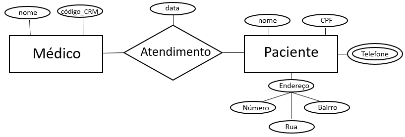
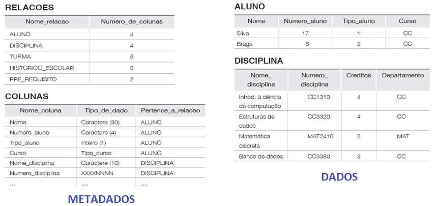
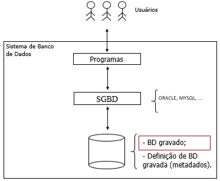
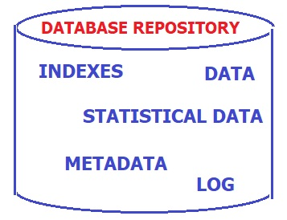
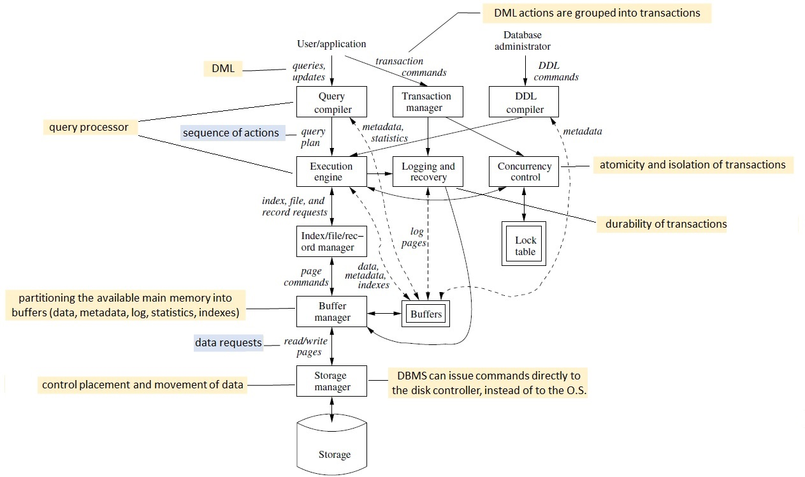

Diario de Bordo Sobre Banco de dados. 

[Univesp](https://www.youtube.com/playlist?list=PLxI8Can9yAHeHQr2McJ01e-ANyh3K0Lfq)

# banco de dados

Um banco de dados é uma coleção de dados. Nesse contexto, um dado é um fato que deve ser armaeznado(Persistido) e qe tem um significado implícito. 

## # Tópico 2 - O que é Banco de Dados?
###### *by Prof. Plinio Sa Leitao-Junior (INF/UFG)*

Algumas definições da literatura:
- WIEDERHOLD - Um banco de dados é uma coleção de dados mutuamente relacionados.
- CHU - Um banco de dados é um conjunto de dados relacionados entre si.
- DATE - Um banco de dados é uma coleção de dados operacionais armazenados usados pelos sistemas de uma determinada aplicação.
- SILBERSCHATZ, KORTH, SUDARSHAN - Um banco de dados é uma coleção de dados que contém informação de um particular empreendimento.
- ELMASRI, NAVATHE - Um banco de dados é uma coleção de dados relacionados.
- ENGLES - Um banco de dados é uma coleção de dados operacionais usados pelo sistema de aplicações de uma empresa.

## Pode-se concluir:

Um banco de dados é um conjunto de **dados relacionados**, que **existe por um período** de tempo, geralmente muitos anos. 

Em outra perspectiva; o termo banco de dados se refere a uma **coleção de dados**, cuja reunião ocorre com **propósito definido**, e que são **gerenciados por software**. 

Sobre o **software** que gerencia o banco de dados, alguns de seus possíveis papéis são:
1. Permitir que os ***usuários***  criem novos bancos de dados e especifiquem seus ***esquemas*** , usando uma ***linguagem de definição de dados***.
2. Dar aos usuários a capacidade de ***consultar os dados***  e ***modificar os dados*** , usando uma linguagem apropriada, geralmente chamada de ***linguagem de consulta***  ou ***linguagem de manipulação de dados***.
3. Suportar o ***armazenamento de grande volume de dados*** - muitos terabytes ou mais - por um longo período de tempo, permitindo ***acesso eficiente***  aos dados para consultas e modificações no banco de dados.
4. Habilitar a ***durabilidade***  e a ***recuperação após falhas***  do banco de dados, devido a ***erros de vários tipos***  ou ***uso indevido intencional***.
5. Controlar o acesso aos dados de vários usuários ao mesmo tempo, sem permitir ***interferências inesperadas entre os usuários*** e sem que ***transações nos dados sejam realizadas parcialmente*** (em vez de ações completas).

## Exercícios

1. Com relação às definições sobre 'o que é banco de dados' (apresentadas no início deste tópico), analise as diferenças entre as definições, com especial atenção aos termos específicos de algumas delas, tais como 'operacionais' e 'usados'.<br>Apresente a sua definição sobre '_o que banco de dados_', tal que englobe o conteúdo das seis definições apresentadas, mas não use os termos (palavras) já presentes nas seis definições.
1. Sobre os possíveis papéis do **software** que gerencia o banco de dados, observe que há termos assinalados em negrito e itálico e seguidos de (??), tais como ***linguagem de consulta*** e ***durabilidade***. Pesquise sobre tais termos, e formule o seu entendimento sobre os mesmos. Não copie o texto da bibliografia, construa a sua interpretação.


# Tópico 3 - Definições

| **#** | **Termo** | **Definição** |
|------|----------|-------------|
| 1 | **Banco de dados** | Coleção organizada de dados armazenados para facilitar o acesso, gerenciamento e atualização. |
| 2 | **Dado** | Qualquer fato, valor ou item de informação armazenado no banco de dados. |
| 3 | **Tipo de dado** | Especificação do formato dos dados, como `int`, `varchar`, `float`. |
| 4 | **Meta-dado** | Dados que descrevem a estrutura e as características do banco de dados, como tabelas, colunas e restrições. |
| 5 | **Tamanho e complexidade do banco de dados** | Relaciona-se à quantidade de dados armazenados e ao nível de interconexão entre eles. |
| 6 | **Banco de dados mantido manualmente ou informatizado** | Pode ser registrado fisicamente (papel) ou gerenciado por software. |
| 7 | **Sistema Gerenciador de Banco de Dados (SGBD)** | Software que controla a criação, manipulação e segurança dos dados. |
| 8 | **Definição, construção, manipulação de um banco de dados** | Processos de criação da estrutura, armazenamento e operação sobre os dados. |
| 9 | **Programa de aplicação** | Software que interage com o banco de dados para atender às necessidades do usuário. |
| 10 | **Consulta** | Comando usado para recuperar informações do banco de dados, geralmente via SQL (`SELECT`). |
| 11 | **Transação** | Conjunto de operações no banco de dados que devem ser executadas integralmente para garantir a consistência dos dados. |
| 12 | **Sistema de banco de dados** | Conjunto do SGBD, banco de dados e aplicativos que interagem com ele. |
| 13 | **Especificação de requisitos e análise conceitual** | Etapas iniciais do projeto de banco de dados, onde se identificam as necessidades dos usuários. |
| 14 | **Projeto conceitual** | Modelagem de alto nível que define entidades, atributos e relacionamentos sem detalhes técnicos. |
| 15 | **Projeto lógico** | Representação estruturada do banco de dados, traduzindo o modelo conceitual para um formato que pode ser implementado. |
| 16 | **Projeto físico** | Implementação final do banco de dados, incluindo armazenamento, índices e otimizações. |
| 17 | **Abordagem tradicional de arquivos X abordagem de banco de dados** | A abordagem de arquivos requer programação personalizada, enquanto a de banco de dados usa SGBDs para gerenciar os dados. |
| 18 | **Natureza auto-descritiva de um sistema de banco de dados** | O banco armazena sua própria estrutura (meta-dados), permitindo autoconfiguração. |
| 19 | **Isolamento entre programas e dados e abstração de dados** | Separação entre a lógica do programa e a estrutura dos dados para facilitar a manutenção. |
| 20 | **Suporte a múltiplas visões dos dados** | Diferentes usuários podem visualizar os dados de formas distintas, conforme suas permissões. |
| 21 | **Compartilhamento de dados e processamento de transações multiusuário** | Permite que vários usuários acessem e modifiquem os dados simultaneamente sem inconsistências. |
| 22 | **Administradores de banco de dados** | Profissionais responsáveis pela manutenção, segurança e otimização do banco de dados. |
| 23 | **Designers de banco de dados** | Criam e estruturam o banco de dados de acordo com os requisitos da aplicação. |
| 24 | **Usuários finais** | Pessoas que interagem com o banco de dados para recuperar ou modificar informações. |
| 25 | **Classificação de usuários finais** | *Casuais:* usam ocasionalmente; *Paramétricos:* operam rotinas predefinidas; *Sofisticados:* fazem consultas complexas; *Autônomos:* criam seus próprios bancos. |
| 26 | **Analistas de sistema e programadores de aplicativos** | Criam sistemas que interagem com bancos de dados. |
| 27 | **Redundância** | Repetição desnecessária de dados, levando ao desperdício de armazenamento e inconsistências. |
| 28 | **Redundância controlada** | Quando a repetição de dados é gerenciada para otimizar desempenho e confiabilidade. |
| 29 | **Restrição de acesso não autorizado** | Mecanismos de segurança para impedir acessos indevidos, como autenticação e permissões. |
| 30 | **Persistência de dados** | Dados permanecem armazenados mesmo após falhas do sistema. |
| 31 | **Processamento de consulta** | Etapas que o SGBD executa para interpretar e otimizar uma consulta SQL. |
| 32 | **Restaurar e recuperar** | Técnicas para restaurar um banco de dados após falhas ou desastres. |
| 33 | **Restrições de integridade** | Regras que garantem a validade dos dados, como unicidade de chaves primárias. |
| 34 | **Integridade referencial** | Garantia de que as relações entre tabelas sejam mantidas corretamente. |
| 35 | **Regras de negócio** | Conjunto de normas que definem como os dados devem ser manipulados e validados. |
| 36 | **Modelos de dados, esquemas e instâncias** | Modelos estruturam dados; esquemas definem a organização; instâncias são os valores armazenados. |
| 37 | **Esquema interno, esquema conceitual, esquemas externos** | Diferentes níveis de abstração na modelagem do banco de dados. |
| 38 | **Linguagens de banco de dados** | Conjunto de linguagens usadas para definir, manipular e consultar dados (SQL, DDL, DML). |
| 39 | **SQL** | Structured Query Language, linguagem padrão para manipulação de bancos relacionais. |
| 40 | **Abstração de dados** | Organização em camadas para esconder detalhes técnicos da implementação. |
| 41 | **Modelo entidade relacionamento** | Modelo gráfico que representa os dados e suas relações. |
| 42 | **Modelo relacional** | Organização dos dados em tabelas com relações entre elas. |
| 43 | **Independência de dados** | Capacidade de modificar a estrutura do banco sem afetar os aplicativos que o utilizam. |
| 44 | **Módulos que compõem um SGBD** | Componentes como gerenciador de armazenamento, processador de consultas e gerenciador de transações. |


# Tópico  4a - Requisitos de Dados - Bd empresas

Há problemas no mundo real cuja solução pode ser alcançada por meio de **software**.<br>
As necessidades e restrições colocadas em um produto de software são representadas por **requisitos de software**. 

A análise, elicitação e especificação de requisitos é uma das etapas do **processo de software**.<br>
Requisitos de software são expressos (especificados) em **artefatos**, cuja construção em geral aplica **modelos** e emprega **notações** tal como a UML, com o apoio de **ferramentas** na escrita desses artefatos.

Ao projetar bancos de dados, os artefatos resultantes &#8212; esquemas de banco de dados &#8212; devem ser tais que contribuam para a missão do software:
- **Questão 01a:** O que significa **projetar um banco de dados**?
- **Questão 01b:** O que é produzido ao **projetar um banco de dados**? Que artefatos são gerados?

Se o banco de dados é parte integrante de um produto de software, então:
- **Questão 02a:** Que esquema de banco de dados atende aos **requisitos de software**?
- **Questão 02b:** Vários esquemas de banco de dados distintos podem atender aos **requisitos de software**?

Independente da classificação de requisitos de software &#8212; funcional ou não-funcional; prioridade do requisito; etc. &#8212; há os **requisitos de dados**, que é parte integrante de todo o conjunto de requisitos de software:
- Os requisitos de dados são os requisitos considerados para o processo de projeto (_design_) de banco de dados.
- Veja a Figura 7.1 no Capítulo 7 da 6a. edição do livro [1], para uma ilustração de contexto dos requisitos de dados.

O processo de projeto de banco de dados inicia por **abstrair os requisitos de dados**:
- **Questão 03a:** Como saber se um esquema de banco de dados, que é produzido pelo processo de projeto de banco de dados, é *adequado* à missão do software?
- **Questão 03b:** O esquema de banco de dados produzido retrata as necessidades, a estrutura e as restrições próprias para o banco de dados?

> Há esquemas de banco de dados em vários níveis de abstração: conceitual, lógico, físico, ...

### Exemplo de requisitos de dados<br>Banco de Dados Empresa - BD Empresa

O livro sugerido [1] para a disciplina inclui requisitos de dados para o **Banco de Dados Empresa** (*Company Database*). Este banco de dados é explorado em quase todo o livro. Os requisitos são apresentados abaixo, na forma de ***descrição textual***, conforme posto no livro.

>***A empresa é organizada em departamentos. Cada departamento tem um nome exclusivo, um número exclusivo e um funcionário em particular que o gerencia. Registramos a data inicial em que esse funcionário começou a gerenciar o departamento. Um departamento pode ter vários locais.<br>
Um departamento controla uma série de projetos, cada um deles com um nome exclusivo, um número exclusivo e um local exclusivo.<br>
Armazenamos o nome, número de Cadastro de Pessoa Física, endereço, salário, sexo (gênero) e data de nascimento de cada funcionário. Um funcionário é designado para um departamento, mas pode trabalhar em vários projetos, que não necessariamente são controlados pelo mesmo departamento. Registramos o número atual de horas por semana que um funcionário trabalha em cada projeto. Também registramos o supervisor direto de cada funcionário (que é outro funcionário).<br>
Queremos registrar os dependentes de cada funcionário para fins de seguro. Para cada dependente, mantemos o nome, sexo, data de nascimento e o parentesco com o funcionário.***

Em nossa disciplina, o **BD Empresa** será utilizado para ilustrar conceitos e apresentar exemplos pertinentes a banco de dados. Outrossim, outros bancos de dados, contextos e aplicações serão explorados, para enriquecer as discussões e ampliar os esforços de compreensão e a escala de aprendizagem.

>*Usaremos o **BD Empresa** em vários dos exemplos apresentados, além de outros bancos de dados, contextos e aplicações.*

Então, vamos nos apropriar (memorizar?) dos requisitos de dados do BD Empresa.

## Exercícios

Leia e releia os requisitos de dados pertinentes ao **BD Empresa**.

1. Identifique 05 (cinco) pontos de imprecisão nos requisitos de dados, conforme o exemplo abaixo:<br>
**Ponto 1:** Não está claro se um dependente é obrigatoriamente um parente do seu empregado responsável.<br>
**Ponto 2:** Múltiplos Gerentes: Não há clareza se um departamento pode ter mais de um gerente ao longo do tempo e como isso seria armazenado. <br>
**Ponto 3:** Locais de Projetos e Departamentos: Não está especificado se um projeto pode estar associado a mais de um local, assim como ocorre com departamentos.br>
**Ponto 4:** Salário e Histórico: Não há menção sobre a necessidade de armazenar o histórico de salários dos funcionários. Se um salário for alterado, a informação anterior será perdida?<br>
**Ponto 5:** Horas de Trabalho em Projetos: Não está definido se há um limite mínimo ou máximo de horas que um funcionário pode dedicar a projetos por semana.

1. Elabore 05 consultas (demandas informacionais) que podem ser respondidas a partir dos requisitos de dados, conforme o exemplo abaixo:<br>
**Consulta 1:** Qual o nome dos funcionários que são supervisores e gerentes de departamento?<br>
**Consulta 2:** Quantos projetos cada funcionário trabalha e quantas horas ele dedica a cada um? <br>
**Consulta 3:** Quais funcionários possuem dependentes e qual a relação de parentesco com cada um? <br>
**Consulta 4:** Qual o salário médio dos funcionários por departamento? <br>
**Consulta 5:** Quais funcionários trabalham em projetos que não pertencem ao seu departamento de origem? <br>

Importante: Evite consultas (demandas informacionais) simples, tal como "Quais os nomes dos funcionários de sexo masculino?".

# Entidades e Atributos, relacionameto



**Entidade**
Uma entidade representa um objeto do mundo real que pode ser identificado de forma única dentro de um sistema de banco de dados. Pode ser um objeto físico (como uma pessoa, um carro, um produto) ou um conceito abstrato (como um pedido, uma venda, uma conta bancária).

📌 Exemplo:

"**Funcionário**" pode ser uma entidade que representa os empregados de uma empresa.

"**Projeto**" pode ser uma entidade que representa diferentes projetos desenvolvidos.

Atributos:
São as características ou propriedades que descrevem uma entidade. Cada entidade possui um conjunto de atributos que armazenam informações sobre ela.

📌 Exemplo de Atributos da entidade "Funcionário":

Nome

CPF (Identificador único)

Endereço

Salário

Data de Nascimento

Sexo

### **Conceito e Forma dos Relacionamentos**  

Os **relacionamentos** representam a associação entre duas ou mais entidades em um banco de dados. Eles indicam como os dados de uma entidade estão conectados aos dados de outra entidade.  

#### **1. Representação dos Relacionamentos**  
No **Modelo Entidade-Relacionamento (MER)**, os relacionamentos são representados por **losangos** (diamantes) e conectam entidades (que são representadas por retângulos).  

#### **2. Tipos de Relacionamento**  

Os relacionamentos podem ser classificados de acordo com a **cardinalidade**, que define quantas ocorrências de uma entidade podem se relacionar com outra. Os três principais tipos são:  

📌 **1. Relacionamento 1:1 (Um para Um)**  
   - Cada entidade A se relaciona com **apenas uma** entidade B e vice-versa.  
   - Exemplo: Cada **departamento** tem um **gerente** e cada gerente gerencia **apenas um** departamento.  
   - Representação:  
     ```
     Departamento (1) —— (1) Funcionário
     ```

📌 **2. Relacionamento 1:N (Um para Muitos)**  
   - Uma entidade A pode se relacionar com **múltiplas** entidades B, mas cada entidade B está associada a **uma única** entidade A.  
   - Exemplo: Um **departamento** pode ter **vários funcionários**, mas cada funcionário pertence a **apenas um** departamento.  
   - Representação:  
     ```
     Departamento (1) —— (N) Funcionário
     ```

📌 **3. Relacionamento N:M (Muitos para Muitos)**  
   - Uma entidade A pode se relacionar com **múltiplas** entidades B e vice-versa.  
   - Exemplo: Um **funcionário** pode trabalhar em **vários projetos**, e um **projeto** pode ter **vários funcionários**.  
   - Como bancos relacionais não suportam diretamente esse tipo de relacionamento, geralmente ele é implementado com uma **tabela intermediária**.  
   - Representação:  
     ```
     Funcionário (N) —— (M) Projeto
     ```

#### **3. Relacionamentos com Atributos**  
Em alguns casos, um relacionamento pode ter atributos próprios. Isso ocorre quando informações precisam ser armazenadas sobre a associação entre entidades.  

🔹 **Exemplo**: O relacionamento **"Trabalha em"** entre **Funcionário** e **Projeto** pode ter um atributo **"Horas Semanais"**, que indica quantas horas o funcionário trabalha no projeto.  
   - Representação:  
     ```
     Funcionário (N) —— "Trabalha em" (com atributo: Horas) —— (M) Projeto
     ```

Quer que eu crie um diagrama MER para ilustrar isso melhor? 🚀

Em um Modelo Entidade-Relacionamento (MER), as entidades são representadas por retângulos e seus atributos por elipses.


## Tópico 5 - Dados e Metados.

Definição abstrata de BD: uma coleção de dados relacionados.

Propriedades implícitas de BD

Uma coleção logicamente coerente de dados com algum significado inerente; um arranjo aleatório de dados não pode ser considerado um banco de dados.
É projetado e construído com dados para um propósito específico; possui um grupo de usuários e algumas aplicações pré-concebidas, as quais esses usuários estão interessados.
Representa algum aspecto do mundo real; alterações neste mundo real são refletidas no banco de dados.
Em síntese … Um banco de dados tem alguma fonte na qual os dados são derivados, alguma taxa de interação com eventos do mundo real, e uma audiência que está ativamente interessada em seu conteúdo.

Dados vs. Metadados
Metadados descrevem, explicam, localizam ou tornam mais fácil recuperar, usar ou gerenciar um recurso de informação. Os metadados costumam ser chamados de dados acerca de dados (ou informações sobre informações).

Metadados descritivos descrevem um recurso para fins de identificação e busca, tais como título, resumo, autor e palavras-chaves.
Metadados estruturais indicam como os objetos compostos são colocados juntos, por exemplo, tal como as páginas são organizadas para formar capítulos.
Metadados administrativos fornecem informações para ajudar a gerenciar um recurso, tais como data de criação do arquivo e tipo de arquivo.
Outro(s).
Os metadados são essenciais para garantir que os recursos possam sobreviver e permanecer acessíveis no futuro.

Para ilustrar a distinção entre dados e metadados, considere a figura a seguir. O banco de dados Universidade é composto por um conjunto de tabelas (no Modelo Relacional, fala-se um conjunto de relações).




O acesso e a interpretação dos dados são, essencialmente, baseados nos metadados, pois eles apoiam a solução de questões tais como:

Em que local estão os dados?
Quais os caminhos (as alternativas) de acesso aos dados?
Dentre os caminhos conhecidos para o acesso aos dados, qual é o mais ágil?
Como os dados estão estruturados?
Qual o conteúdo por trás desta sequência de caracteres (ou de bits)?
etc.
No contexto da área de Banco de Dados, a literatura usa vários termos para se referir aos metadados, alguns deles são: esquema de dados, descrição de dados, definição dos dados, dicionário de dados, catálogo de dados.

Exercício
Considere o conteúdo do texto Types of Metadata. Leia e releia o texto.
Observe que a tabela na segunda página do texto possui 06 linhas, cada linha se refere a um tipo de metadados, conforme a seguir (identificados de 1 a 6):

Descriptive metadata
Technical metadata
Preservation metadata
Rights metadata
Structural metadata
Markup languages

## Tópico 6 - Sistema gerenciador de banco de dados.


Um Sistema de Gerenciador de Banco de Dados (SGBD) é um **software** que apoia os usuários na criação e manutenção de um banco de dados. O termo ***usuários*** é empregado aqui com sentido amplo e inclui: *administrador de banco de dados*, *projetista de banco de dados*, *usuário final*, *programador de aplicação*, etc.

O SGBD atua nos processos de definição, construção, manipulação e compartilhamento de bancos de dados entre usuários e aplicações:
- **Definição de banco de dados:** se refere à especificação de tipos de dados, estruturas de dados, regras e restrições de integridade, etc., que são armazenadas no dicionário (catálogo) de dados.
- **Construção de banco de dados:** denota a armazenagem de dados em meio controlado pelo SGBD; noutras palavras é a carga inicial do banco de dados.
- **Manipulação de banco de dados:** lida com a consulta ao banco de dados para *recuperar* dados específicos, e a atualização do banco de dados para *estar em sintonia* com os dados do mundo real.
- **Compartilhamento de banco de dados**. visa ao acesso simultâneo de vários usuários e programas ao banco de dados.

O SGBD deve trabalhar uniformemente com vários tipos de aplicação de banco de dados – por exemplo, universidade, instituição bancária, etc. – sempre utilizando a *definição de dados* gravada no catálogo.

> **O SGBD é de propósito geral. Os metadados são de propósito específico.**
> 
A Figura à esquerda abaixo mostra um **sistema de banco de dados** genérico, em que usuários interagem com programas de aplicação por meio de suas *interfaces*. O acesso propriamente dito aos dados ocorre por meio do SGBD que, por sua vez, necessita dos metadados para atender às solicitações oriundas dos usuários. 

A figura à direita abaixo apresenta um escopo mais amplo sobre o banco de dados, que inclui vários conteúdos adicionais aos dados: dicionário de dados, índice, dados estatísticos. Nesse sentido, o SGBD emprega os conteúdos adicionais para aprimorar o desempenho de suas funções. Por exemplo, o SGBD avalia se há a presença de um índice que possa ser aplicado a uma operação específica, tal que torne o atendimento a tal operação mais eficiente (em tempo).




Algumas benefícios potenciais para o emprego de SGBDs são:
- suporte a múltiplas visões dos dados;
- compartilhamento de dados entre múltiplos usuários;
- consistência transacional;
- restrição de acesso aos dados para usuários não autorizados;
- suporte à redundância controlada;
- garantia da restrição de integridade, que mantém os dados íntegros (consistentes);
- mecanismos de segurança dos dados, tais como, cópia (*backup*) e recuperação (*recovery*) de dados;
- etc.

A Figura a seguir explora os _componentes_ da **Arquitetura de um SGBD** típico, conforme [1].



## Exercício

Considere os seguintes componentes da **Arquitetura de um SGBD** típico (identificados de 1 a 6):

1. Concurrency control
2. Transaction manager
3. Query compiler
4. Logging and recovery
5. Buffer manager
6. Execution engine

Pesquise sobre cada um dos componentes da arquitetura típica de um SGBD listados acima.