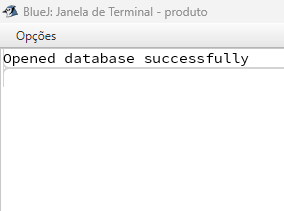
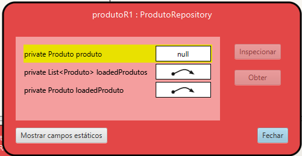
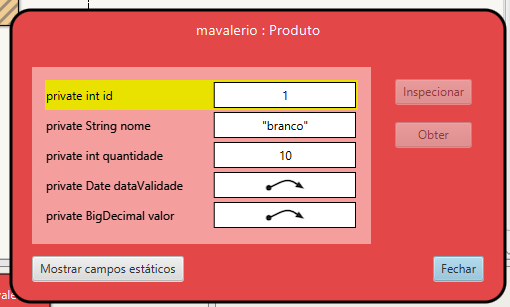
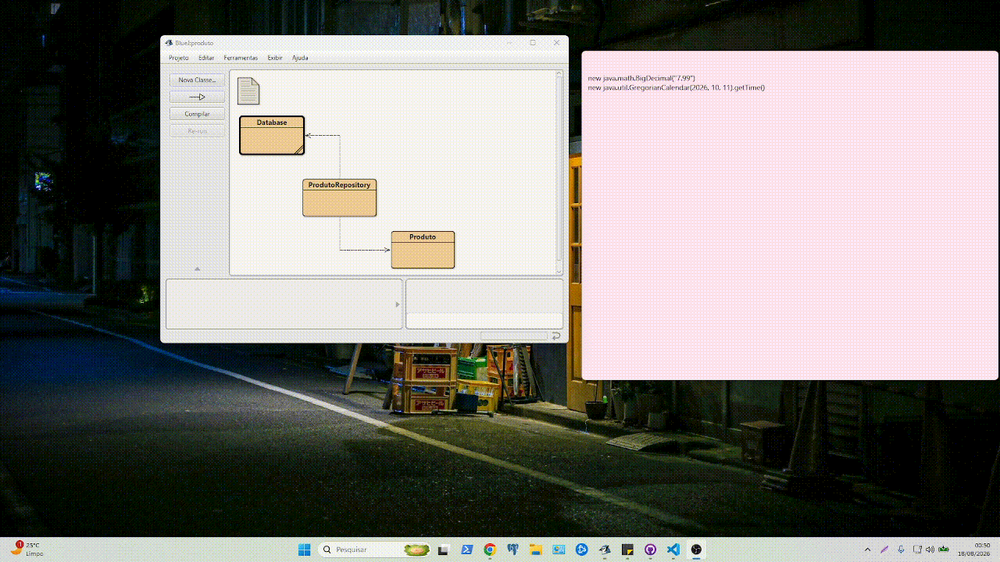

# AT-08-12 - Criar e persistir uma entidade via ORM
---
Baseado no tutorial [ORM](https://github.com/marceloakira/tutorials/tree/main/orm)., crie outro exemplo de entidade com pelo menos 3 tipos diferentes de atributos (String, data, decimal, etc). Apresente um relatório com prints de telas com exemplos bem sucedidos com as 4 operações CRUD (Create, Retrieve, Update e Delete) no banco de dados SQLite. Comente cada tela produzida, explicando o respectivo cõdigo produzido para implementar e testar a operação.

[Link GITHUB](https://github.com/Teroriata/Estudos/blob/main/SPD/AT-08-12.md).

## 1. Classe database
---
Para realizar a persistência dos dados da entidade Produto, foi utilizada uma classe denominada Database, responsável por estabelecer e gerenciar a conexão entre a aplicação Java e o banco de dados SQLite.

A conexão é realizada através do driver JDBC e da classe JdbcConnectionSource, fornecida pelo ORMLite. Ao criar um objeto Database, é informado o nome do arquivo que armazenará o banco de dados. O método getConnection() verifica e estabelece a conexão quando necessário, utilizando a URL jdbc:sqlite: seguida do nome do arquivo. Já o método close() é responsável por encerrar a conexão com o banco.

Dessa forma, a classe Database centraliza o acesso ao SQLite e fornece a conexão que será posteriormente utilizada pela classe ProdutoRepository para realizar as operações de criação, consulta, atualização e exclusão dos produtos.
```
import java.sql.*;
import com.j256.ormlite.jdbc.JdbcConnectionSource;

public class Database
{
    private String databaseName = null;
    private JdbcConnectionSource connection = null;

    public Database(String databaseName)
    {
        this.databaseName = databaseName;
    }

    public JdbcConnectionSource getConnection() throws SQLException
    {
        if (databaseName == null)
        {
            throw new SQLException("database name is null");
        }

        if (connection == null)
        {
            try
            {
                connection = new JdbcConnectionSource(
                    "jdbc:sqlite:" + databaseName
                );
            }
            catch (Exception e)
            {
                System.err.println(
                    e.getClass().getName() + ": " + e.getMessage()
                );
                System.exit(0);
            }

            System.out.println("Opened database successfully");
        }

        return connection;
    }

    public void close()
    {
        if (connection != null)
        {
            try
            {
                connection.close();
                this.connection = null;
            }
            catch (java.lang.Exception e)
            {
                System.err.println(e);
            }
        }
    }
}
```


## 2. Classe ProdutorRepository
---
A classe ProdutoRepository é responsável por realizar a comunicação entre a entidade Produto e o banco de dados SQLite. Para isso, utiliza o padrão Repository em conjunto com o ORMLite, centralizando as operações relacionadas à persistência dos produtos.  

Nesta classe foi implementadas as quatro operações do padrão CRUD: create() para cadastrar um novo produto, loadFromId() e loadAll() para consultar os produtos armazenados, update() para atualizar os dados de um produto existente e delete() para excluir um produto.  
```
import com.j256.ormlite.dao.DaoManager;
import com.j256.ormlite.dao.Dao;
import java.sql.SQLException;
import com.j256.ormlite.table.TableUtils;
import java.util.List;
import java.util.ArrayList;

public class ProdutoRepository
{
    private static Database database;
    private static Dao<Produto, Integer> dao;
    
    private Produto produto;
    
    private List<Produto> loadedProdutos;
    private Produto loadedProduto;

    public ProdutoRepository(Database database)
    {
        ProdutoRepository.setDatabase(database);
        loadedProdutos = new ArrayList<Produto>();
    }

    public static void setDatabase(Database database)
    {
        ProdutoRepository.database = database;

        try
        {
            dao = DaoManager.createDao(
                database.getConnection(),
                Produto.class
            );

            TableUtils.createTableIfNotExists(
                database.getConnection(),
                Produto.class
            );
        }
        catch(SQLException e)
        {
            e.printStackTrace();
        }
    }

    // CREATE
    public Produto create(Produto produto)
    {
        try
        {
            int nrows = dao.create(produto);

            if(nrows == 0)
            {
                throw new SQLException("Erro: produto não salvo");
            }

            this.loadedProduto = produto;
            this.loadedProdutos.add(produto);
        }
        catch(SQLException e)
        {
            e.printStackTrace();
        }

        return produto;
    }

    // UPDATE
    public void update(Produto produto)
    {
        try
        {
            dao.update(produto);
            this.loadedProduto = produto;
        }
        catch(SQLException e)
        {
            e.printStackTrace();
        }
    }

    // DELETE
    public void delete(Produto produto)
    {
        try
        {
            dao.delete(produto);
            this.loadedProdutos.remove(produto);

            if(this.loadedProduto == produto)
            {
                this.loadedProduto = null;
            }
        }
        catch(SQLException e)
        {
            e.printStackTrace();
        }
    }

    // RETRIEVE - buscar pelo ID
    public Produto loadFromId(int id)
    {
        try
        {
            this.loadedProduto = dao.queryForId(id);

            if(this.loadedProduto != null)
            {
                this.loadedProdutos.add(this.loadedProduto);
            }
        }
        catch(SQLException e)
        {
            e.printStackTrace();
        }

        return this.loadedProduto;
    }

    // RETRIEVE - buscar todos
    public List<Produto> loadAll()
    {
        try
        {
            this.loadedProdutos = dao.queryForAll();

            if(this.loadedProdutos.size() != 0)
            {
                this.loadedProduto = this.loadedProdutos.get(0);
            }
        }
        catch(SQLException e)
        {
            e.printStackTrace();
        }

        return this.loadedProdutos;
    }

    public Produto getLoadedProduto()
    {
        return loadedProduto;
    }

    public List<Produto> getLoadedProdutos()
    {
        return loadedProdutos;
    }
}
```

## 3. Classe Produto
---
A classe Produto foi desenvolvida para representar a entidade utilizada neste projeto e armazenar as informações dos produtos que serão persistidos no banco de dados SQLite. Para realizar o mapeamento entre a classe Java e o banco, foram utilizadas as anotações fornecidas pelo ORMLite.

A entidade possui os atributos id, nome, quantidade, dataValidade e valor. Esses atributos utilizam diferentes tipos de dados, como String para o nome, int para a quantidade, Date para a data de validade e BigDecimal para representar o valor decimal do produto. O atributo id funciona como identificador único e é gerado automaticamente pelo ORMLite.
```
import java.util.Date;
import java.text.SimpleDateFormat;
import java.math.BigDecimal;

import com.j256.ormlite.table.DatabaseTable;
import com.j256.ormlite.field.DatabaseField;
import com.j256.ormlite.field.DataType;

@DatabaseTable(tableName = "produto")
public class Produto
{
    // ATRIBUTOS

    @DatabaseField(generatedId = true)
    private int id;

    @DatabaseField
    private String nome;

    @DatabaseField
    private int quantidade;

    @DatabaseField(dataType = DataType.DATE)
    private Date dataValidade;

    @DatabaseField(dataType = DataType.BIG_DECIMAL)
    private BigDecimal valor;


    // MÉTODOS DE FORMATAÇÃO

    public String printDataValidade()
    {
        SimpleDateFormat dateFor =
            new SimpleDateFormat("dd/MM/yyyy");

        return dateFor.format(dataValidade);
    }

    public String printValor()
    {
        return "R$ " + valor.toString().replace(".", ",");
    }


    // GETTERS E SETTERS

    public int getId()
    {
        return this.id;
    }

    public void setId(int id)
    {
        this.id = id;
    }


    public String getNome()
    {
        return this.nome;
    }

    public void setNome(String nome)
    {
        this.nome = nome;
    }


    public int getQuantidade()
    {
        return this.quantidade;
    }

    public void setQuantidade(int quantidade)
    {
        this.quantidade = quantidade;
    }


    public Date getDataValidade()
    {
        return this.dataValidade;
    }

    public void setDataValidade(Date dataValidade)
    {
        this.dataValidade = dataValidade;
    }


    public BigDecimal getValor()
    {
        return this.valor;
    }

    public void setValor(BigDecimal valor)
    {
        this.valor = valor;
    }
}
```



## 4. Demonstração
---
## Conclusão da Demonstração

O GIF apresentado demonstra o funcionamento completo das operações CRUD desenvolvidas no BlueJ utilizando Java, ORMLite e o banco de dados SQLite. Durante a execução, foi possível realizar o cadastro de um produto por meio da operação **Create**, consultar os dados armazenados com **Retrieve**, modificar as informações existentes através do **Update** e, por fim, remover o registro utilizando **Delete**.

A demonstração permite observar na prática a integração entre as classes **Database**, **Produto** e **ProdutoRepository**. A classe **Database** gerencia a conexão com o SQLite, a classe **Produto** representa os dados da entidade e a classe **ProdutoRepository** executa as operações de persistência através do ORMLite.

Dessa forma, os testes demonstrados no GIF confirmam o funcionamento das quatro operações CRUD e mostram que os objetos criados na aplicação podem ser armazenados, consultados, atualizados e excluídos do banco de dados SQLite.

