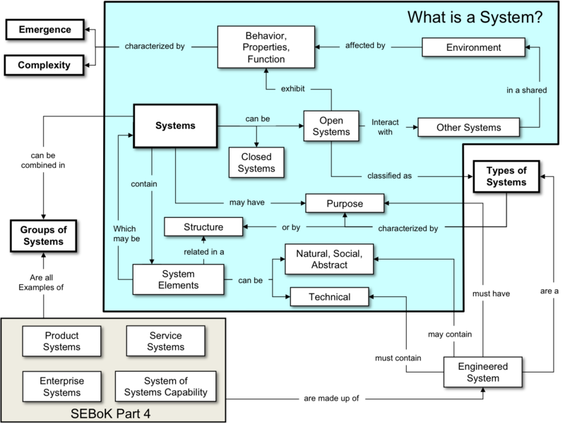

# o que é um sistema

Sistemas são conjuntos organizados de elementos complexos: espaçonaves, projeto de chips, robótica, criação de softwares para construir pontes, ...

- Sistemas são conjuntos organizados de elementos (elementos técnicos, naturais ou sociais combinados) interdependentes que interagem para alcançar um objetivo comum. 
    - Esses elementos podem ser pessoas, máquinas, procedimentos, políticas, tecnologias ou outros recursos que trabalham juntos em um ambiente específico para cumprir uma função específica.
- Um sistema pode ser comparado a uma grande sinfonia, com vários instrumentos e conjuntos. 
    - Todos funcionando conjuntamente e perfeitamente afinados.

A coleção de elementos que compõem um sistema deve ser vista como um todo em relação aos demais elementos ao seu redor.

---

- **Segundo Oliveira (2002)** um **sistema** é: “conjunto de partes interagentes e interdependentes que, conjuntamente, formam um todo unitário com determinado objetivo e efetuam determinada função”
    - Além de um mesmo objetivo, caso haja qualquer alteração em uma de suas partes, haverá também consequências no sistema como um todo, ou seja, relação de **interdependência das partes**
___

- **O International Council on Systems Engineering Handbook (INCOSE 2015)**  definiu sistema como uma combinação interativa de elementos para atingir um objetivo definido. Os elementos incluem hardware, software, firmware, pessoas, informação, técnicas, instalações, serviços e outros elementos de suporte.

Eles podem ser classificados de diferentes maneiras, dependendo do objetivo ou do tipo de interação entre seus elementos, mas todos compartilham a característica de serem conjuntos complexos e interdependentes.

Em um Sistema precisa haver coerência suficiente entre as partes para que o todo faça sentido. 

Nos devemos também considerar situações mais complexas onde as partes de um sistema também podem ser vistas como sistemas.

- Assim nos poderemos identificar conceitos de sistema comuns para auxiliar nossa compreensão. 

Assim é possível a criação de teorias de sistema, modelos e abordagens para o entendimento, criação e uso de elementos relacionados, independente do que o sistema é feito ou do seu domínio de aplicação.

A Teoria geral dos sistemas fornece uma forma de enxergar o conhecimento humano de maneira sistêmica e integrada em favor de um objetivo maior.

O propósito da teoria dos sistemas é investigar pontos em comum entre os diferentes campos de conhecimento e descobrir suas dinâmicas, problemas e princípios (propósito, métodos, ferramentas, etc), a fim de produzir resultados.

A teoria dos sistemas representa algumas mudanças de perspectivas sob alguns aspectos:
- Das partes para o todo. Através da teoria dos sistemas, o foco não é mais o objeto de estudo de cada área, mas sim as relações entre essas diferentes áreas
- De medição para mapeamento dessas relações
- De análises quantitativas para análises qualitativas de dados
- De conhecimento objetivo para conhecimento epistemológico, ou seja, “conhecimento sobre o conhecimento”

A teoria geral dos sistemas apresenta alguns conceitos que são essenciais para a sua compreensão:
- Sistema: organismo composto por partes independentes e interligadas.
- Fronteiras: limites que definem um sistema e os separa de outros.
- Entropia: esta relacionada ao nível de desordem do sistema
- Homeostase ou “estado firme”: resistência a alterações por parte de um sistema com tendência a manter-se em equilíbrio.
- Ambiente: contexto externo no qual o sistema está situado.
- Entrada ou input: fenômeno ou causa que inicia o funcionamento do sistema.
- Saída ou output: consequência final do funcionamento do sistema. Os resultados devem ser coerentes com o propósito do sistema.
- Processamento ou throughput: processo de conversão das entradas em saídas.
- Retroalimentação ou feedback: reação do sistema a estímulos exteriores. Pode ser positiva ou negativa. Feedbacks positivos fazem o sistema agir de acordo com a entrada recebida enquanto negativo força um funcionamento contrário (resistente).

Apesar de serem formados por diversas partes independentes, os sistemas possuem características e atributos únicos que não existem em nenhuma das partes isoladas que o compõem. Essas características são:
- Propósito: os sistemas sempre visam atender uma finalidade que não pode ser satisfeita por nenhuma das suas partes isoladas.
- Totalidade: tendo em vista que os sistemas são organismos, qualquer alteração sofrida em uma das partes produzirá consequências em todas as outras.

Todo sistema é formado por partes ou elementos, ou seja, outros subsistemas.

Nesse sentido, sistemas, apesar de comporem diferentes áreas do conhecimento (como biologia, física, administração, etc.), possuem características universais determinadas por leis comuns.

Essas características dividem os sistemas em dois grupos distintos, isto é, com qualidades que os diferenciam entre abertos ou fechados.

Os tipos mais simples de sistemas são os chamados “sistemas fechados”.

A característica principal desse modelo sistêmico é capacidade de não sofrer influência pelo meio externo, e vice-versa.

Não interagem com o ambiente ao seu redor.

Nesse caso, os sistemas fechados não são alterados diretamente pelos meios em que estão inseridos, bem como não possuem a capacidade de influenciá-los. 

Assim, eles “consomem a própria energia” para se manter.

Exemplos são a bola de gelo ou uma garrafa térmica, que é capaz de sustentar o seu próprio calor por um longo período de tempo.

Temos também os chamados sistemas abertos, cuja qualidade principal é a de, ao mesmo tempo, influenciar e sofrer influências de seus meios externos.

Há no sistema aberto transferências, tanto positivas quanto negativas, de elementos e energia entre ele próprio e o ambiente, ou seja, existe uma influência recíproca.

Nesse sentido, exemplos de sistemas abertos, dentro de nosso contexto, são um sistema de informação, motores de automóveis, o corpo humano (que troca a todo momento matéria e energia com o mundo ao seu redor) e as organizações (desempenhando papel fundamental para todos os indivíduos e às sociedades).

Na teoria administrativa, as organizações são vistas como sistemas abertos que recebem entradas na forma de energia, suprimentos, pessoas, etc e fornecem saídas como produtos e serviços.

Na Tecnologia da Informação, um sistema é o conjunto formado por software, hardware e recursos humanos. 

É uma das áreas mais simples de se identificar a aplicação da teoria geral dos sistemas, tendo em vista que um sistema de informação responde aos inputs inseridos e produz um resultado.

Um engenheiro de sistemas é uma pessoa que projeto e cria sistemas complexos e eficientes. 

Modelagem, simulação, otimização e avaliação final de projetos.

Pode ser comparado ao maestro de uma orquestra.

Profissionais de diversas áreas e diversas formações podem executar as atividades de engenharia de sistemas. 

Responsabilidades específicas incluem:

Projeto e criação de sistemas o complexos e eficientes

Preparação de listas de requisitos

Modelagem, simulação, otimização e avaliação final de projetos

Documentação, descrições funcionais e criação manuais

Gestão e configuração de controles

Validação e verificação de projetos

Gestão de risco de valores críticos 

Análise de confiabilidade e erros, bem como garantia de qualidade

Execução de tarefas de gerenciamento de projeto, incluindo planejamento

Apresentações do design do sistemas
## Systems thinking

Systems thinking, ou pensamento sistêmico,  é o paradigma fundamental que descreve como devemos olhar o mundo e os sistemas. 

Em vez de observar as partes separadas, o Systems Thinking adota uma visão holística para entender como as partes se encaixam. Afinal, partes do sistema afetam umas às outras.

Em síntese, é preciso entender o que é importante para o negócio, com base no sistema todo, para tomar melhores decisões. 

Ou seja, a melhor solução provavelmente vai exigir o exame da situação a partir de uma perspectiva global.

## System of Interest

O sistema de interesse é o sistema específico que está sendo analisado ou desenvolvido.

O sistema de interesse pode ser um sistema físico, como um avião, um carro, um edifício, um equipamento industrial, um dispositivo médico, ou pode ser um sistema não físico, como um sistema de software, um sistema de controle de tráfego aéreo, um sistema de gerenciamento de informações, entre outros.

Independentemente do tipo de sistema, os engenheiros de sistemas precisam entender como o sistema funciona, quais são seus requisitos e como ele pode ser melhorado para atender às necessidades do usuário e às expectativas do cliente.

Uma vez que o sistema de interesse é definido, os engenheiros de sistemas podem criar modelos do sistema, realizar simulações, prototipagem e testes para validar o sistema, e, em seguida, implementar o sistema em um ambiente de produção.

Ao identificar o sistema de interesse, os engenheiros de sistemas podem definir seus requisitos e funcionalidades, identificar os componentes e subsistemas que compõem o sistema, e avaliar seu desempenho, confiabilidade, segurança, capacidade de manutenção, entre outros aspectos. 

Isso ajuda a garantir que o sistema seja desenvolvido ou melhorado de acordo com as necessidades do usuário e as expectativas do cliente.

## Engineered System

Traduziremos engineered system como sistema projetado ou sistema produzido por engenharia ou sistema de engenharia ou simplesmente sistema. 

Engenharia de sistemas é um campo interdisciplinar da engenharia que se foca no desenvolvimento e organização de sistemas artificiais complexos.

Um engineered system é um sistema aberto de elementos técnicos ou sócio-técnicos que possui propriedades emergentes não encontradas em seus elementos individuais. 

- Ele é criado por pessoas e para pessoas
- Tem propósito em diferentes aspectos
- Gera resultado de valor para seus stakeholders
- Tem um ciclo de vida e uma dinâmica de evolução
- Possui fronteiras estabelecidas e um ambiente externo
- É parte de um system-of-interest (SOI)

**Systems engineering** é uma abordagem que foca na realização de sistemas (produzidos por engenharia) de sucesso.

Seu foco esta no:
- Entendimento das necessidades do usuário
- Na exploração das oportunidades
- Na documentação dos requisitos
- Na síntese, verificação, validação e definição de soluções para o problema como um todo