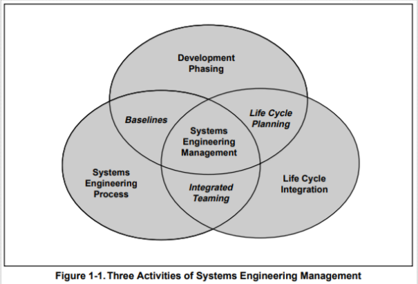
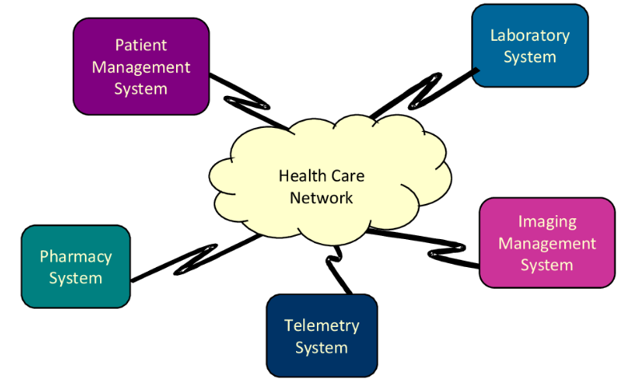
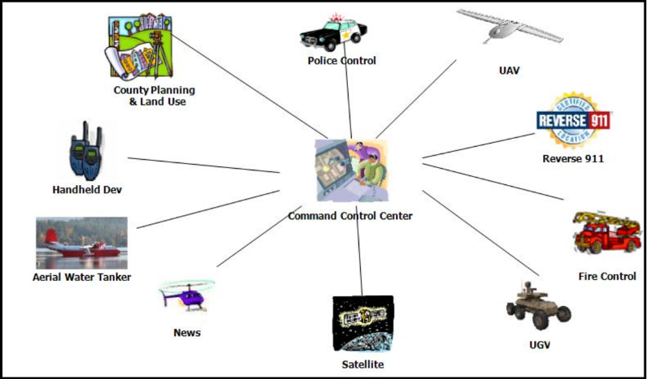
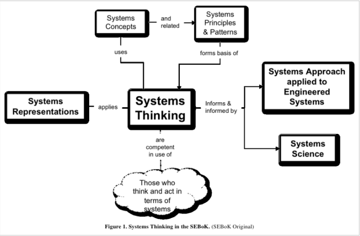
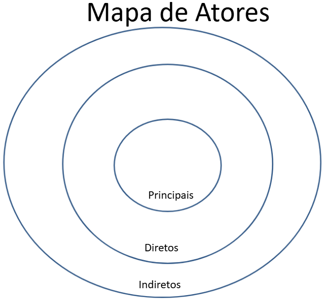

# aula 2 - Engenharia de Sistemas

Engenharia de Sitemas inclui:
- de onde vem os problemas;
- como eles são definidos e identificados;
- como selecionamos soluções candidatas;
- como equilibramos tecnologia e elementos humanos no contexto mais amplo da solução;
- e como os sistemas complexos são gerenciados, usados, mantidos e descartados. 

---

As interações entre os elementos do sistema definem/sugerem o **limite do Sistema** e o que significa **ser parte do Sistema**.

- Para sistemas fechados, todos os aspectos do sistema existem dentro do seu limite. 

O limite do um sistema aberto define elementos e relacionamentos que podem ser considerados parte do sistema e descreve como esses elementos **interagem através da sua fronteira** com elementos do ambiente externo. 

---
4 tipos específicos de Sistema são normalmente reconhecidos na engenharia de sistemas:

- **Sistema de produção:** é um sistema de engenharia no qual o foco do ciclo de vida é desenvolver e entregar produtos.
- **Sistema de serviço:** é um sistema de engenhari criado e mantido por uma organização que fornece resultados para clientes.
    - o foco esta na entrega de resutados ou serviços e não produtos.
- **Sistema corporativo:** consiste de uma combinação de recursos (pessoas, processos, organizações, tecnologia e financiamento) que interagem para:
    - coordenar funções
    - compartilhar informação
    - criar fluxos de trabalho
    - e tomar decisões para atingir os objetivos de negócio.
- **sistema de Sistemas (SoS)** é uma forma de integrar sistemas independentes e seus relacionamentos, formando **um todo maior que a soma das partes**. 

Desta forma, um SoS permite alcançar **objetivos complexos** que não poderiam ser facilmente alcançados individualmente pelos seus sistemas constituintes. 

Em um SoS, **comportamentos emergentes** podem surgir a qualquer momento. 
Um SoS deve idealmente satisfazer diversas características:
- independência operacional e gerencial dos sistemas constituintes
- distribuição geográfica
- comportamento emergente
- desenvolvimento evolutivo. 

# Complexidade de Sistemas

A **complexidade estrutural** observa os elementos do sistema e seus relacionamentos. 
- Observa as diferentes formas como os elementos do sistema podem ser combinados. 
- Desta forma ela se relaciona como a capacidade potencial do sistema se **adaptar às necessidades externas**. 

**Complexidade dinâmica** considera a complexidade que pode ser observada quando os sistemas são utilizadas para realizar tarefas, desta forma o **elemento tempo** deve ser considerado. 

**Complexidade Sócio-política** considera os efeitos dos indivíduos na complexidade. 

---

O foco principal da abordagem de sistemas é a **complexidade organizada** (organized complexity). 

Este tipo de complexidade não pode ser tratada por técnicas de análise tradicionais. 

Sillitto (2014) considera que existe uma ligação entre o tipo de complexidade e a arquitetura do Sistema. 

### Principais características dos elementos dos sistemas e seus relacionamentos:
**Independência:** os elementos de um sistema devem ser capazes de tomar suas próprias decisões, influenciados pelas informações de outros sistemas.

**Interconexão:** Elementos de um sistema se conectam via conexão fisica, dados compartilhados ou simplesmente uma percepção visual dos outros elementos, como no caso do bando de gansos ou do esquadrão de aeronaves. 

**Diversidade:** Elementos de um sistema podem ser tecnologicamente ou funcionalmente diferentes. 

**Adaptabilidade:** Elementos de um sistema auto organizado podem sustentar a si mesmos ou a todo um sistema em resposta ao seu ambiente. 

# Emergência

Emergência é a consequência do conceito fundamental do holismo e da interação

Um sistema possui comportamentos e propriedades decorrentes da organização de seus elementos e de seus relacionamentos, que só se tornam aparentes quando o sistema é colocado em ambientes diferentes.

O comportamento de um sistema emergente pode ser visto como uma consequência da interação e dos relacionamentos entre os elementos, e não dos próprios elementos isoladamente. 

O comportamento emergente

A emergência é comum na natureza.
Em um pássaro, suas partes individuais, bicos, penas e asas não tem a capacidade de vencer a gravidade. 
Quando devidamente combinados geram o comportamento emergente do voo. 

- **Emergência simples** é gerada pela combinação de elementos e seus relacionamentos em sistemas não complexos ou ordenados. 
    - A propriedade emergente de voo controlado não é alcançada somente pelas asas ou sistema de controle ou sistema de propulsão, mas sim pela ligação desses 3 elementos
    - A emergência simples pode ser prevista. 
- **Emergência fraca** é a emergência desejada devido a estrutura do Sistema. 

- **Emergência forte** é a emergência não esperada, ou seja, só aparece quando o sistema é simulado ou testado ou até mesmo quando o sistema esta em operação.

# System Thinking

O pensamento sistêmico está preocupado em compreender ou intervir em situações-problema, com base nos princípios e conceitos do paradigma sistêmico.

Quando se observa ou interage com um sistema, se atribui limites e nomes as partes desse sistema. 

Essa nomeação pode refletir a hierarquia natural do sistema mas também reflete as necessidades e experiência do observador.

System Thinking requer um processo de atenção e adaptação que garanta que tudo foi adequadamente definido: limites, dependencias e relacionamentos. 

O pensamento sistêmico, também chamado de pensamento holístico, é a habilidade de entender os fatos não apenas em si mesmos, mas em relação às outras pessoas e instâncias envolvidas na situação.

Ou seja, se você tem um pensamento holístico, você é capaz de entender quais serão as implicações de um acontecimento para os envolvidos diretamente e também para quem está indiretamente relacionado na situação.

O pensamento sistêmico nas organizações se opõe ao pensamento linear. 

Segundo essa linha de raciocínio, uma empresa se comporta como uma linha de montagem: uma etapa depois da outra, funcionando de forma mais ou menos independente, até ter o produto completo no fim de tudo.

---
# Futuro dos Sistemas
Visão do Incose:

Os sistemas relevantes e influentes vão além dos sistemas tradicionais aeroespaciais e de defesa e si estenderão para vários outros sistemas. 

Sistemas serão aplicados fortemente às necessidades de tomada de decisão produzindo sistemas mas inteligentes e autônomos. 

Sistemas do future serão menores, mais organizados, sustentáveis, eficientes, robustos e seguros. 

Haverão muitos veículos autônomos e sistemas de transporte. 

---

# Identificando e Entendendo Problemas e Oportunidades

De acordo com Jenkins (1969), o primeiro passo na abordagem de sistemas e reconhecer e formular o problema. 

## Exploração do Problema

O pensamento sistêmico não olha o “problema”, mas considera uma situação problemática. 

A visão sistêmica ajuda as partes interessadas a entender melhor os pontos de vista de todos, fornecendo um ponto de partida para uma intervenção direcionada.

## Identificação do Problema

O pensamento sistêmico é baseado na premissa de que um problema existe e pode ser declarado pelos stakeholders de uma forma objetiva. 

Mas isso não significa que a abordagem sistêmica inicia com um problema definido. 

Explorar o potencial problema com os stakeholders chave é uma parte fundamental. 

Definir o problema muitas vezes é a parte mais importante e o passo mais difícil. 

## Formulação do Problema.

- Existem várias maneiras de formular um problema, mas aqui estão algumas dicas para ajudá-lo a criar uma formulação clara e eficaz:
1. Comece identificando o problema que você deseja resolver. 
    - Qual é o objetivo principal? Qual é o resultado esperado?
2. Descreva o problema de forma clara e concisa. 
    - Evite usar jargão ou linguagem técnica desnecessária que possa confundir o leitor.
3. Identifique os fatores que contribuem para o problema. 
    - Liste as variáveis relevantes e descreva como elas se relacionam com o problema.
4. Considere diferentes perspectivas e pontos de vista. 
    - Pense em como diferentes partes interessadas podem ver o problema e como isso pode afetar sua fozmulação.
5. Use dados e fatos concretos sempre que possível. 
    - Isso ajuda a tornar o problema mais tangível e pode ajudar a identificar soluções potenciais.
6. Formule o problema como uma pergunta ou declaração clara e direta. 
    - Isso ajuda a manter o foco e a clareza em torno do objetivo principal.
- Lembre-se de que a formulação de um problema é uma etapa crítica no processo de solução de problemas. 
- Uma formulação clara e bem definida ajudará a orientar suas investigações e aumentará suas chances de encontrar uma solução eficaz.

## Mapa de Atores

- Liste os stakeholders, dividindo-os em atores indiretos, diretos e principais.

- Priorize os stakeholders que são mais relevantes para o serviço, levando em consideração alguns critérios, que podem ser alterados e utilizados da maneira que a equipe achar mais adequado:
    - Impacto
    - Proximidade da relação
    - Influência
    - Poder
    - Urgência ou tensão
    - Representação
    - Ponto de Vista diferenciado

Organize de acordo com a priorização definida.
Depois de todos os atores posicionados, verifique se falta algum público e se a priorização está fazendo sentido. Altere quando necessário.

