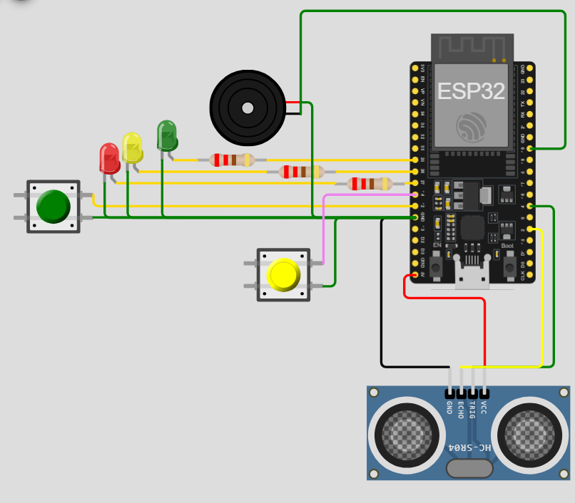
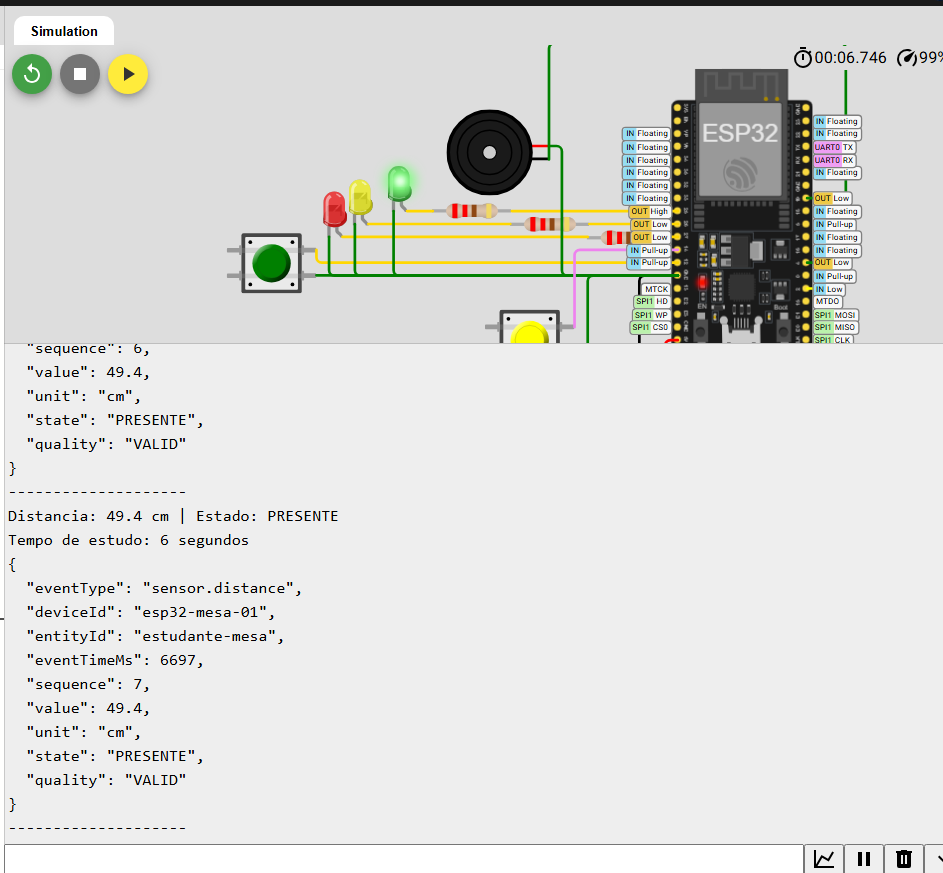
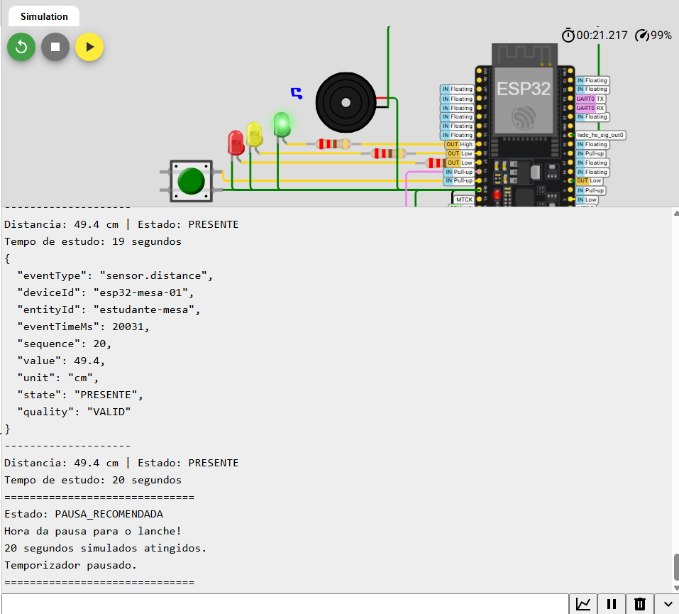
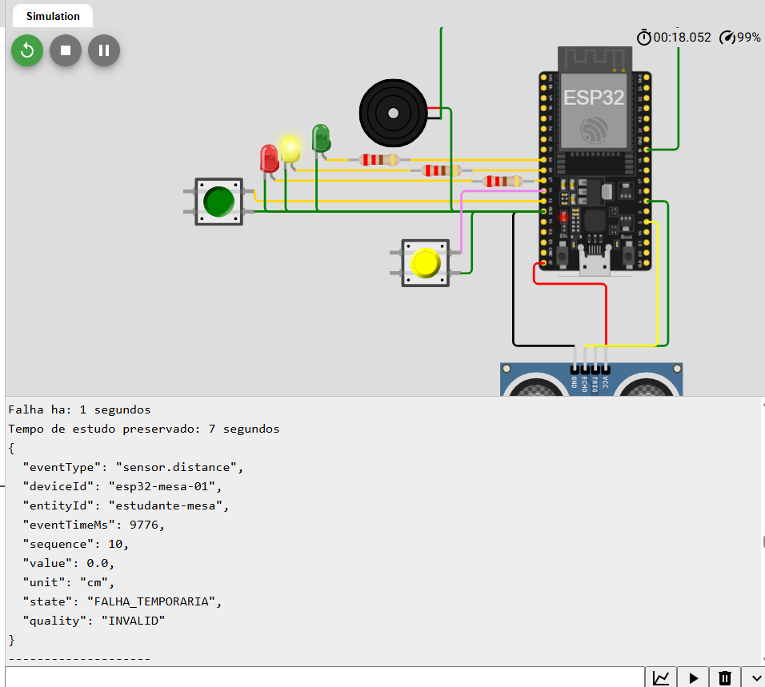
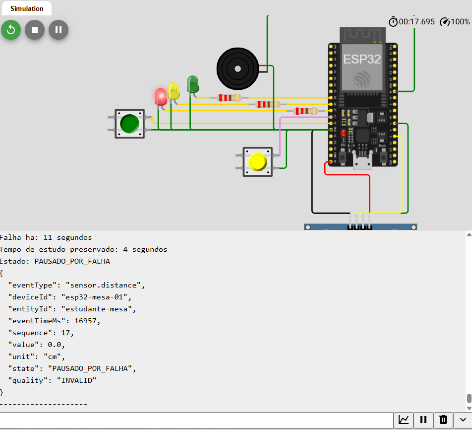
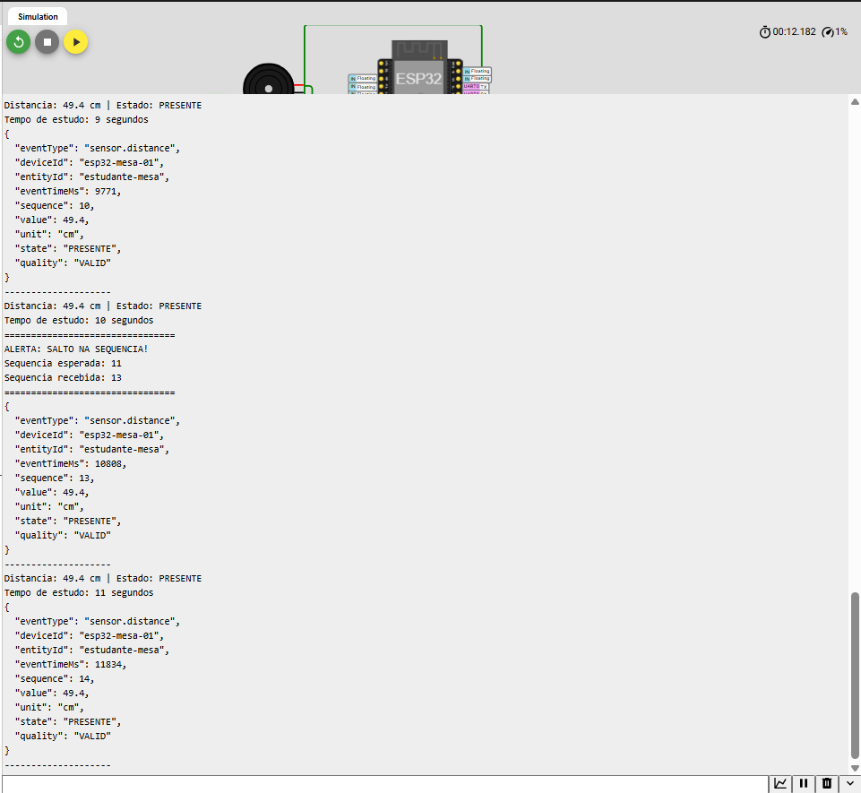

# Atividade Individual 03 — Protótipo Ubíquo no Wokwi

## Lembrete Inteligente de Pausa para Estudo em Casa

**Aluno:** Mateus Silva de Sousa  
**Matrícula:** 201802778  
**Plataforma:** Wokwi  
**Microcontrolador:** ESP32
**Projeto no Wokwi:** [Acessar simulação](https://wokwi.com/projects/474821214622038017)

---

## 1. Descrição do protótipo

Este protótipo é um recorte individual do sistema ubíquo desenvolvido nas atividades anteriores.

O sistema utiliza um sensor ultrassônico HC-SR04 para identificar a presença de um estudante na mesa de estudos por meio da distância medida.

Quando uma leitura válida indica que o estudante está presente, o sistema contabiliza o tempo de estudo. Para facilitar a demonstração no Wokwi, um período de **20 segundos representa os 50 minutos de estudo do cenário original**.

Ao atingir esse período, o sistema entra no estado `PAUSA_RECOMENDADA`, interrompe a contagem e aciona um buzzer para lembrar o estudante de realizar uma pausa.

---

## 2. Responsabilidade individual

A responsabilidade individual adotada foi **Sensoriamento e Qualidade**.

O foco da implementação está no tratamento de leituras inválidas ou indisponíveis do sensor de distância.

Uma falha isolada não faz o sistema concluir imediatamente que o estudante deixou a mesa. O sistema entra inicialmente no estado `FALHA_TEMPORARIA` e preserva o tempo de estudo já contabilizado.

Caso o sensor volte a fornecer dados válidos, o sistema retorna ao funcionamento normal e continua a sessão a partir do tempo anteriormente armazenado.

Se a falha permanecer por 8 segundos, o sistema entra no estado `PAUSADO_POR_FALHA`, evitando contabilizar tempo de estudo sem uma informação confiável de presença.

---

## 3. Componentes utilizados

| Componente | GPIO | Função |
|---|---:|---|
| HC-SR04 TRIG | 4 | Disparo do sensor ultrassônico |
| HC-SR04 ECHO | 2 | Recebimento do sinal de retorno |
| Botão de falha | 12 | Simulação de falha do sensor |
| Botão adversarial | 14 | Simulação de salto na sequência |
| LED verde | 25 | Funcionamento normal / presença |
| LED amarelo | 26 | Falha temporária |
| LED vermelho | 27 | Falha persistente |
| Buzzer | 19 | Alerta de pausa |

Os LEDs utilizam resistores de 220 Ω.

---

## 4. Regras de funcionamento

A leitura do HC-SR04 é considerada válida quando está entre **5 cm e 300 cm**.

Dentro dessa faixa:

- Distância menor que 80 cm: estudante presente.
- Distância igual ou superior a 80 cm: estudante ausente.

Valores menores que 5 cm, maiores que 300 cm ou ausência de resposta do sensor são tratados como leituras inválidas.

Durante a simulação foram utilizados os seguintes tempos:

| Regra | Tempo |
|---|---:|
| Alerta inicial de falha | 3 segundos |
| Falha persistente | 8 segundos |
| Pausa de estudo simulada | 20 segundos |
| Alerta sonoro | 1,5 segundo |

Os 20 segundos utilizados no simulador representam os 50 minutos previstos no cenário original.

---

## 5. Estados do sistema

### PRESENTE

O estudante foi identificado a uma distância inferior a 80 cm e a leitura é válida e o LED verde permanece aceso e o tempo de estudo é contabilizado.

### AUSENTE

A leitura é válida, porém a distância é igual ou superior a 80 cm. O tempo acumulado é preservado e não aumenta enquanto o estudante estiver ausente.

### FALHA_TEMPORARIA

O sensor apresenta uma leitura inválida ou a falha é acionada pelo botão conectado ao GPIO 12.

O LED amarelo é acionado e o tempo de estudo permanece preservado.

Após 3 segundos de falha, o sistema também apresenta um alerta no Monitor Serial.

### PAUSADO_POR_FALHA

Quando a falha permanece por 8 segundos, o sistema considera que não possui dados confiáveis suficientes para continuar a sessão.

O LED vermelho é acionado e o temporizador permanece pausado.

Quando o sensor volta a fornecer uma leitura válida, o sistema informa sua recuperação e retorna ao funcionamento normal.

### PAUSA_RECOMENDADA

Após 20 segundos de presença válida acumulada, o sistema entra no estado `PAUSA_RECOMENDADA`.

O temporizador é congelado em 20 segundos e o buzzer é acionado por 1,5 segundo.

---

## 6. Evento estruturado

O protótipo gera eventos estruturados em JSON no Monitor Serial.

Exemplo:

```json
{
  "eventType": "sensor.distance",
  "deviceId": "esp32-mesa-01",
  "entityId": "estudante-mesa",
  "eventTimeMs": 6500,
  "sequence": 6,
  "value": 49.4,
  "unit": "cm",
  "state": "PRESENTE",
  "quality": "VALID"
}
```


## 7. Testes e Evidências

Para validar o funcionamento do protótipo, foram realizados testes no ambiente Wokwi considerando o funcionamento normal, a decisão com atuação, o tratamento de falhas do sensor e o cenário adversarial definido de acordo com o último algarismo da matrícula.

### 7.1 Operação normal

Neste teste, o sensor HC-SR04 foi configurado com o estudante dentro da distância considerada como presença, inferior a 80 cm. O sistema iniciou no estado normal, sem falhas ativas e com o temporizador de estudo abaixo do limite definido.

Durante a execução, as leituras foram consideradas válidas e o sistema permaneceu no estado `PRESENTE`. O LED verde permaneceu aceso e o tempo de estudo foi incrementado normalmente.

Os eventos gerados no Monitor Serial apresentaram `quality` igual a `VALID`, juntamente com a distância medida, identificação do dispositivo, sequência do evento e estado atual.

**Resultado esperado:** identificar a presença do estudante, manter o LED verde aceso, contabilizar o tempo de estudo e gerar eventos válidos.

**Resultado observado:** o comportamento ocorreu conforme esperado, mantendo o estado `PRESENTE` enquanto a distância permaneceu dentro da faixa definida.



---

### 7.2 Pausa recomendada e atuação

O segundo teste verificou a regra temporal responsável pelo lembrete de pausa. Para tornar a demonstração viável no simulador, foram utilizados 20 segundos de presença contínua para representar os 50 minutos definidos no cenário original.

O estudante foi mantido dentro da faixa de presença e o temporizador continuou sendo incrementado até atingir o limite estabelecido.

Ao alcançar 20 segundos, o sistema alterou seu estado para `PAUSA_RECOMENDADA`, interrompeu o incremento do temporizador e manteve o valor acumulado em 20 segundos. Como atuação, o buzzer conectado ao GPIO 19 foi acionado por aproximadamente 1,5 segundo.

**Resultado esperado:** ao atingir o limite de tempo, interromper a contagem, registrar `PAUSA_RECOMENDADA` e acionar o alerta sonoro.

**Resultado observado:** o temporizador foi congelado no limite estabelecido, o novo estado foi apresentado no Monitor Serial e o buzzer foi acionado corretamente.



---

### 7.3 Falha temporária do sensor

Para avaliar o comportamento do sistema diante de uma leitura não confiável, foi utilizado o botão conectado ao GPIO 12. Esse botão permite simular de forma controlada uma falha na leitura do sensor.

O teste foi iniciado com o estudante presente e com tempo de estudo já acumulado. Ao pressionar o botão, a leitura passou a ser tratada como inválida e o sistema entrou no estado `FALHA_TEMPORARIA`.

Durante esse estado, o temporizador de estudo deixou de aumentar, mas o valor anteriormente acumulado foi preservado. O LED amarelo foi acionado para representar visualmente a condição de falha. Após 3 segundos, o Monitor Serial também passou a informar um alerta de problema na leitura.

Os eventos JSON gerados durante a falha utilizaram `quality` igual a `INVALID`, indicando que a informação do sensor não deveria ser utilizada como uma leitura confiável de presença ou ausência.

**Resultado esperado:** não interpretar imediatamente a falha como ausência, preservar o tempo acumulado e indicar a condição de leitura inválida.

**Resultado observado:** o sistema entrou em `FALHA_TEMPORARIA`, manteve o tempo de estudo armazenado, acionou o LED amarelo e identificou os eventos como inválidos.



---

### 7.4 Falha persistente

O teste anterior foi continuado mantendo o botão de falha pressionado. Quando a leitura permaneceu inválida por 8 segundos, o sistema considerou que não possuía informações confiáveis suficientes para continuar normalmente.

Nesse momento, o estado foi alterado de `FALHA_TEMPORARIA` para `PAUSADO_POR_FALHA`. O LED amarelo foi desligado e o LED vermelho foi acionado. O tempo de estudo continuou preservado e sem incremento.

Quando o botão foi liberado e o HC-SR04 voltou a fornecer uma leitura válida, o sistema identificou a recuperação do sensor e pôde retornar ao funcionamento normal sem perder o tempo válido acumulado anteriormente.

**Resultado esperado:** após 8 segundos de falha contínua, entrar em `PAUSADO_POR_FALHA`, interromper qualquer contabilização baseada em dados não confiáveis e sinalizar visualmente a condição.

**Resultado observado:** o sistema realizou a transição corretamente, acionando o LED vermelho e mantendo o temporizador preservado.



---

### 7.5 Teste adversarial — Salto na sequência

O teste adversarial foi definido de acordo com o último algarismo da matrícula `201802778`. Como a matrícula possui final 8, o cenário obrigatório corresponde a evento repetido, evento fora de ordem ou salto na sequência. Neste protótipo foi escolhido o **salto na sequência dos eventos**.

Para permitir a execução controlada desse cenário, foi adicionado um segundo botão conectado ao GPIO 14. Durante o funcionamento normal, os eventos são gerados com valores sequenciais no campo `sequence`.

Ao pressionar o botão adversarial, o protótipo simula a perda de dois eventos. Dessa forma, se o próximo valor esperado fosse 6, por exemplo, o sistema poderia receber diretamente a sequência 8.

O Monitor Serial informa a diferença entre a sequência esperada e a recebida:

```text
ALERTA: SALTO NA SEQUENCIA!
Sequencia esperada: 6
Sequencia recebida: 8
Dois eventos foram simulados como perdidos.
```

Após a identificação da anomalia, o sistema não tenta recriar os eventos que não foram recebidos. A sequência recebida passa a ser utilizada como nova referência, fazendo com que os eventos seguintes continuem em 9, 10, 11 e assim sucessivamente.

**Resultado esperado:** provocar um salto controlado, tornar a anomalia observável e continuar a geração dos eventos a partir da sequência recebida.

**Resultado observado:** o salto foi identificado e informado corretamente no Monitor Serial. Após a ocorrência, os eventos seguintes mantiveram a continuidade a partir do novo número de sequência.



---

## 8. Resultado dos testes

Os testes realizados demonstraram que o protótipo consegue diferenciar o funcionamento normal de situações de falha e tomar decisões utilizando estado e tempo, em vez de depender apenas de uma leitura instantânea do sensor.

A implementação também demonstrou a preservação do tempo de estudo durante períodos em que não existem dados confiáveis, a recuperação após uma falha temporária, a atuação por meio de LEDs e buzzer e a geração de eventos estruturados com identificação, tempo, sequência, valor, unidade, estado e qualidade.

O teste adversarial demonstrou ainda a possibilidade de identificar descontinuidades na sequência dos eventos, tornando observável uma possível perda de dados durante a execução.